# VLSI Design and Synthesis Lab Work

---

## About This Repository

This repository contains the VLSI Design and Synthesis laboratory work completed during the workshop. The work covers the complete RTL-to-gate-level design flow, including Verilog RTL coding, functional simulation, waveform analysis, Yosys synthesis, logic optimization, technology mapping, gate-level simulation, VSD BabySoC synthesis and Sequence Detector verification.

The laboratory work was carried out using:

* Verilog HDL
* GVim / VI
* Icarus Verilog
* GTKWave
* Yosys
* SKY130 Standard-Cell Library
* Linux Terminal
* VSD BabySoC Environment

---

# Complete VLSI Design Flow

The overall flow followed during the laboratory work was:

```text
RTL Design
    ↓
Verilog Coding
    ↓
Testbench
    ↓
RTL / Functional Simulation
    ↓
Icarus Verilog
    ↓
VCD Generation
    ↓
GTKWave
    ↓
Yosys Synthesis
    ↓
Logic Optimization
    ↓
Technology Mapping
    ↓
Gate-Level Netlist
    ↓
Gate-Level Simulation
    ↓
GTKWave Verification
```

---

# Tools Used

| Tool           | Purpose                                  |
| -------------- | ---------------------------------------- |
| GVim / VI      | Verilog source-code creation and editing |
| Verilog HDL    | RTL hardware description                 |
| Icarus Verilog | RTL and gate-level simulation            |
| GTKWave        | Waveform visualization                   |
| Yosys          | RTL synthesis and optimization           |
| SKY130 Library | Standard-cell technology mapping         |
| Linux Terminal | Command-line design flow                 |
| VSD BabySoC    | SoC-level synthesis and verification     |

---

# RTL Design, Simulation and Synthesis

## 1. VLSI Design Flow

The laboratory started with understanding the complete RTL-to-gate-level VLSI design flow.

```text
RTL Design
    ↓
Verilog Coding
    ↓
Testbench
    ↓
Simulation
    ↓
Synthesis
    ↓
Optimization
    ↓
Technology Mapping
    ↓
Gate-Level Netlist
    ↓
Gate-Level Simulation
```

### Screenshot

```text
screenshots/01_vlsi_design_flow.png
```
.png>)
---

## 2. RTL Functional Simulation

Verilog RTL designs were simulated using Icarus Verilog.

Example:

```bash
iverilog good_mux.v tb_good_mux.v
./a.out
```

The generated VCD file was viewed using GTKWave.

```text
RTL
 ↓
Testbench
 ↓
Icarus Verilog
 ↓
VCD
 ↓
GTKWave
```

### Screenshot

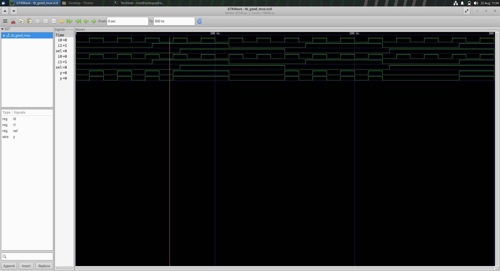

---

## 3. GTKWave Waveform Analysis

GTKWave was used to observe the simulation waveforms and verify the functional behavior of the RTL design.

Important input, control and output signals were examined.


---

## 4. Yosys Synthesis

Yosys was used to convert RTL into a synthesized hardware representation.

Typical commands used were:

```bash
yosys
read_verilog good_mux.v
synth -top good_mux
show
```

Technology mapping was performed using the SKY130 standard-cell library.

```bash
read_liberty -lib ../lib/sky130_fd_sc_hd__tt_025C_1v80.lib
abc -liberty ../lib/sky130_fd_sc_hd__tt_025C_1v80.lib
```

### Screenshot

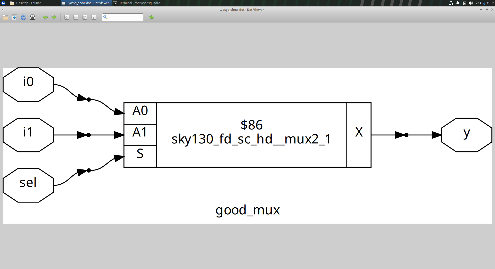

---

## 5. Hierarchical RTL Design

Hierarchical RTL design was studied using multiple Verilog modules.

The basic structure was:

```text
Top Module
     ↓
Sub-Module 1
     ↓
Intermediate Signals
     ↓
Sub-Module 2
     ↓
Output
```

This demonstrates how complex designs can be constructed using smaller reusable modules.

### Screenshot

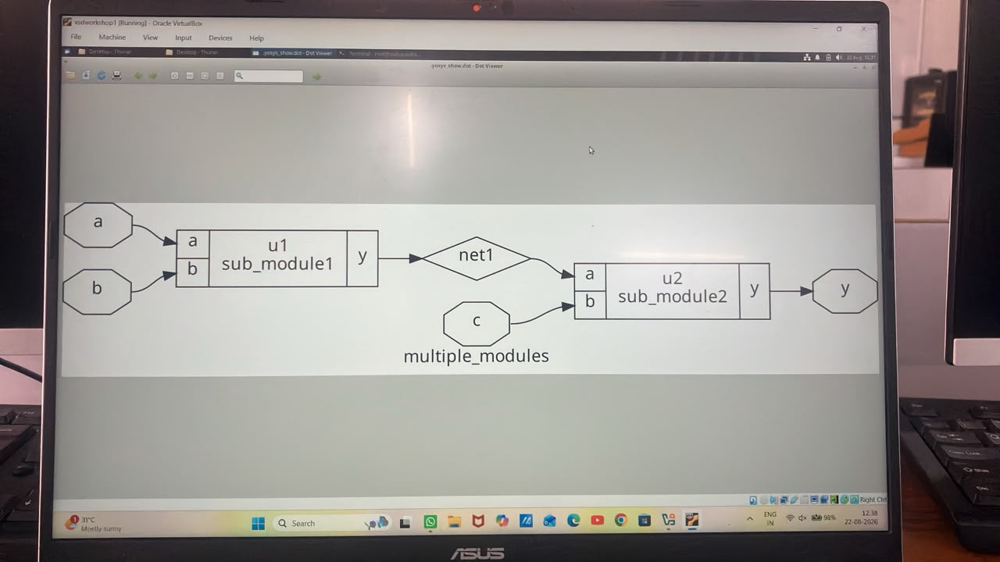

---

## 6. Sequential Logic and Counter Synthesis

Sequential logic was studied using clocked circuits, flip-flops and counters.

The RTL-to-synthesis flow was:

```text
Sequential RTL
      ↓
RTL Simulation
      ↓
Yosys Synthesis
      ↓
Technology Mapping
      ↓
Synthesized Circuit
```

### Screenshot

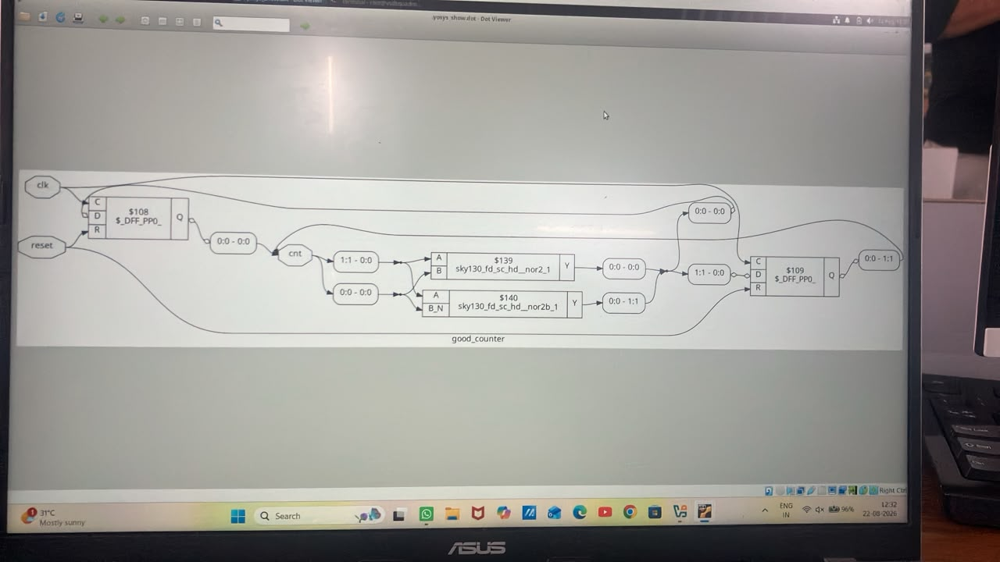

---

## 7. Leakage Power Information

Power and leakage information available in the standard-cell Liberty library was studied.

Liberty files contain electrical and timing information for standard cells, including leakage-power characteristics.

### Screenshot

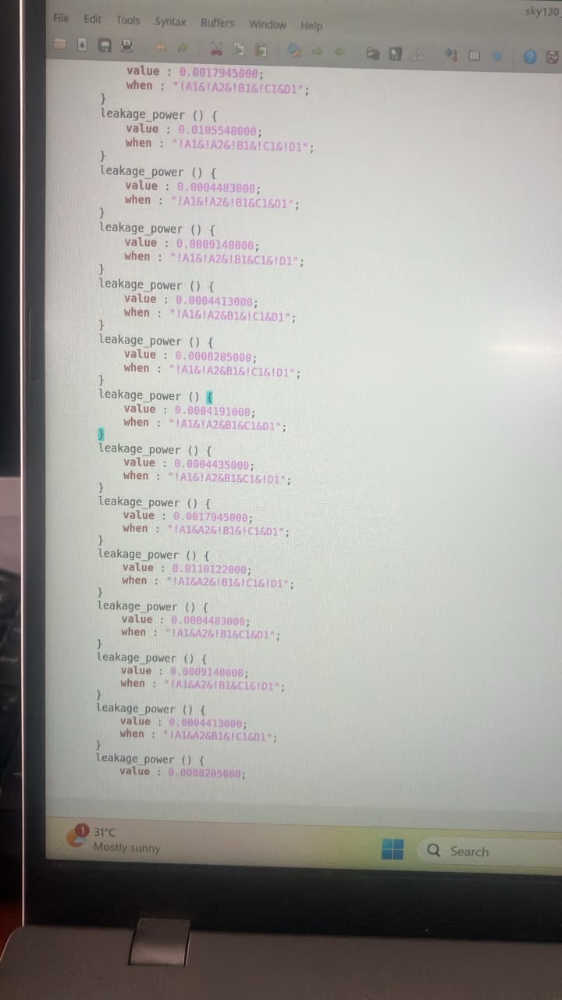

---

# MUX Design, Optimization and Gate-Level Simulation

## 8. Good MUX Functional Simulation

A Good MUX was implemented as a combinational circuit.

The MUX can be described using the ternary operator:

```verilog
assign y = sel ? i1 : i0;
```

The RTL was simulated using Icarus Verilog and the output was verified using GTKWave.


---

## 9. Good MUX Yosys Synthesis

The Good MUX RTL was synthesized using Yosys.

Typical synthesis flow:

```text
RTL
 ↓
read_verilog
 ↓
synth
 ↓
Optimization
 ↓
ABC Technology Mapping
 ↓
Synthesized Circuit
```

### Screenshot


---

## 10. Good MUX Technology-Mapped Design

After synthesis and technology mapping, the Good MUX was represented using cells from the SKY130 standard-cell library.

The synthesized schematic was viewed using Yosys.

.png>)

---

## 11. Good MUX Gate-Level Simulation

The synthesized Good MUX netlist was simulated using SKY130 Verilog cell models.

Typical flow:

```text
Gate-Level Netlist
       +
SKY130 Cell Models
       +
Testbench
       ↓
Icarus Verilog
       ↓
VCD
       ↓
GTKWave
```

### Screenshot

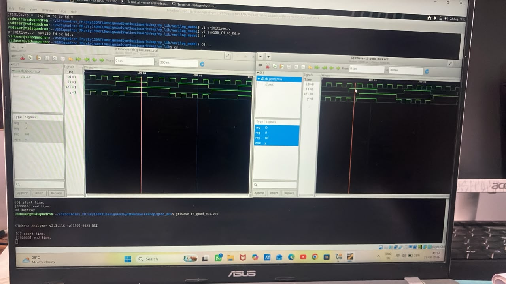

---

## 12. Bad MUX

A Bad MUX implementation was studied to understand how RTL coding style can affect simulation and synthesis behavior.

The Good MUX and Bad MUX implementations were compared to understand proper combinational RTL coding.

### Screenshot


---

## 13. Good MUX vs Bad MUX

The Good MUX and Bad MUX implementations were compared using their simulation behavior.

```text
Good MUX
   ↓
Correct RTL
   ↓
Expected Behavior

Bad MUX
   ↓
Problematic RTL
   ↓
Unintended / Different Behavior
```

---

## 14. Gate-Level Simulation Using Icarus Verilog

Gate-Level Simulation was studied to verify the synthesized circuit using standard-cell models.

The general GLS flow was:

```text
RTL
 ↓
Synthesis
 ↓
Gate-Level Netlist
 ↓
Standard-Cell Models
 ↓
Testbench
 ↓
Icarus Verilog
 ↓
VCD
 ↓
GTKWave
```

### Screenshot


---

# VSD BabySoC

## 15. BabySoC Synthesis

The VSD BabySoC was used to apply the RTL-to-synthesis flow to a larger practical System-on-Chip design.

The BabySoC design includes the RVMYTH processor, clock-gating logic, PLL and DAC related modules.

The synthesis flow included reading the RTL modules and standard-cell libraries followed by Yosys synthesis.

Example:

```bash
yosys
```

```bash
read_verilog src/module/vsdbabysoc.v
read_verilog -I src/include src/module/rvmyth.v
read_verilog -I src/include src/module/clk_gate.v
```

Libraries were loaded using `read_liberty`, followed by:

```bash
synth -top vsdbabysoc
```
### Screenshot
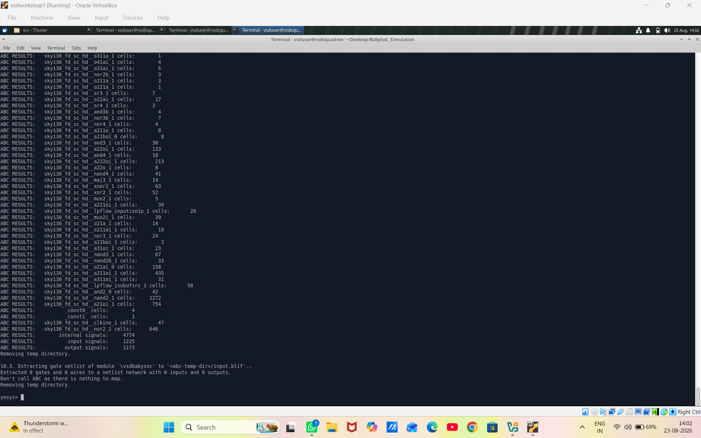
---

## 16. BabySoC Synthesized Netlist

The synthesized BabySoC gate-level netlist was generated after synthesis and technology mapping.

The netlist represents the synthesized hardware implementation using standard-cell instances.

### Screenshot

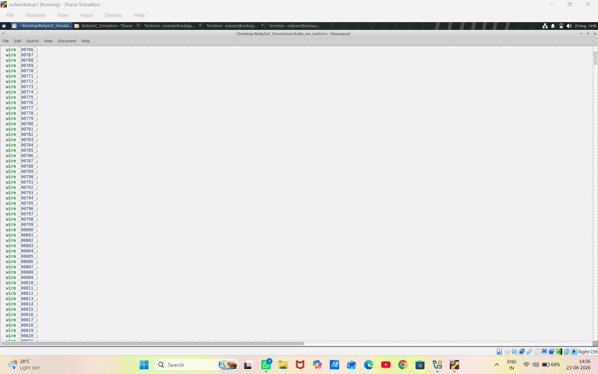

---

## 17. BabySoC Synthesized Design

The synthesized BabySoC design was viewed using the Yosys `show` command.

The schematic provides a visual representation of the synthesized hardware.

### Screenshot

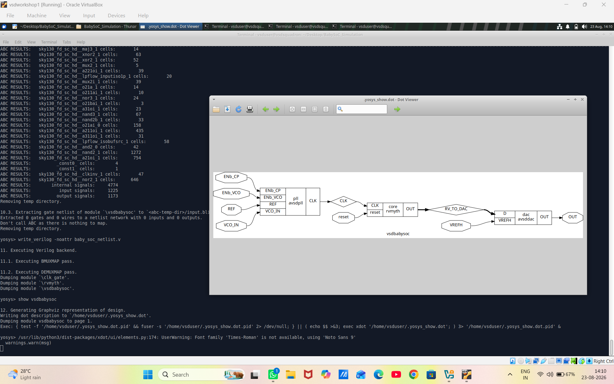

---

## 18. BabySoC Large Gate-Level Netlist

The large generated BabySoC gate-level netlist was inspected during the synthesis process.

This demonstrates the complexity of the synthesized SoC design compared with smaller RTL examples.

### Screenshot

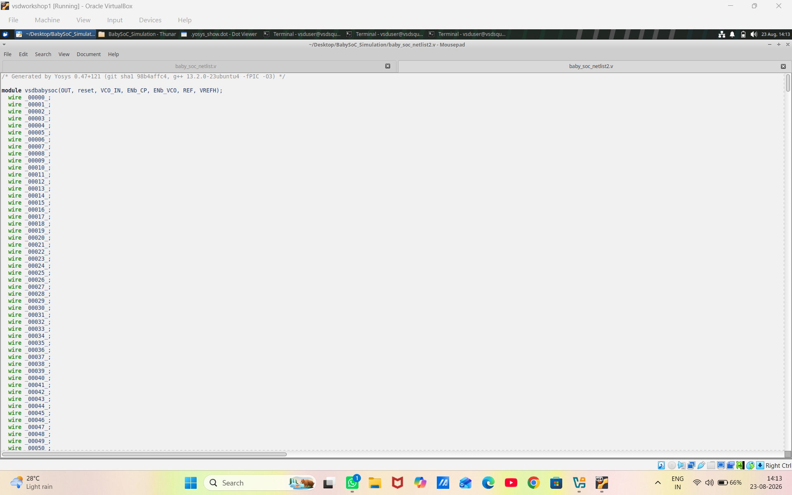

---

## 19. BabySoC Synthesis Statistics

The Yosys `stat` command was used to inspect the synthesized BabySoC design.

```bash
stat
```

The statistics provide information about wires, cells and mapped standard-cell instances.

### Screenshot

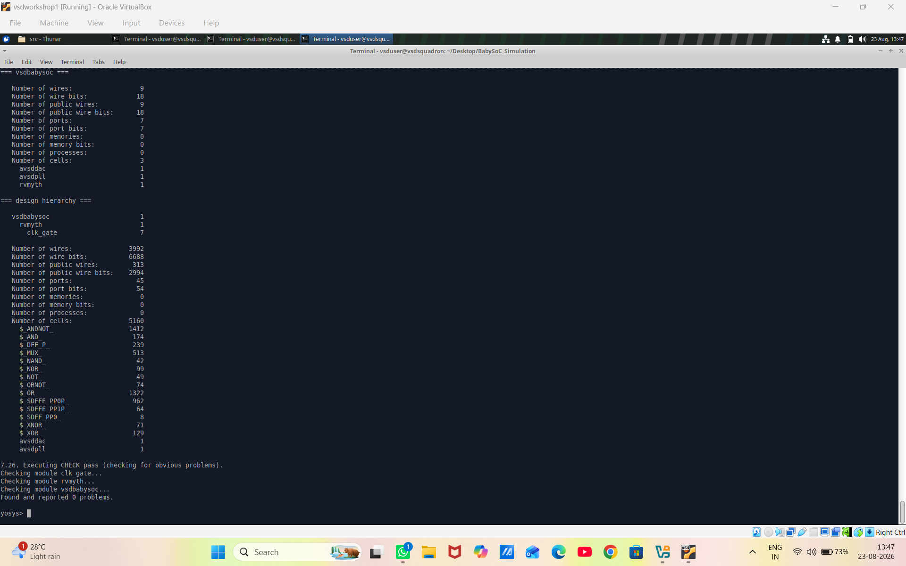

---

## 20. BabySoC Optimization

The synthesized BabySoC design was optimized using Yosys commands such as:

```bash
dfflibmap -liberty src/lib/sky130_fd_sc_hd__tt_025C_1v80.lib
opt
abc -liberty src/lib/sky130_fd_sc_hd__tt_025C_1v80.lib
flatten
setundef -zero
clean -purge
rename -enumerate
```

These operations help optimize and prepare the design for technology mapping and gate-level verification.

### Screenshot

.png>)

---

## 21. BabySoC Design Check and Statistics

The final synthesized BabySoC design was checked and its statistics were observed after optimization and technology mapping.


---

## 22. BabySoC Simulation Waveform

The BabySoC simulation waveform was observed using GTKWave.

Important signals were examined to verify the behavior of the design.


---

## 23. BabySoC Pre-Synthesis Simulation

Pre-synthesis simulation was performed using the original BabySoC RTL and testbench.

The flow was:

```text
BabySoC RTL
     ↓
Testbench
     ↓
Icarus Verilog
     ↓
Pre-Synthesis Simulation
     ↓
VCD
     ↓
GTKWave
```

Example command:

```bash
iverilog -o ./pre_synth_sim.out \
-DPRE_SYNTH_SIM \
src/module/testbench.v \
-I src/include \
-I src/module/
```

### Screenshot

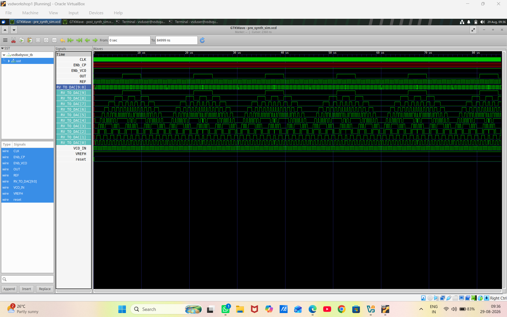

---

## 24. BabySoC Post-Synthesis Simulation

Post-synthesis simulation was performed to verify the synthesized gate-level BabySoC implementation.

The flow was:

```text
Synthesized Design
       +
SKY130 Verilog Models
       +
Testbench
       ↓
Icarus Verilog
       ↓
Post-Synthesis Simulation
       ↓
VCD
       ↓
GTKWave
```

Example command:

```bash
iverilog -o ./post_synth_sim.out \
-DPOST_SYNTH_SIM \
src/module/testbench.v \
-I src/include \
-I src/module/
```

The SKY130 Verilog model path was included when required.

### Screenshot


### Comparison

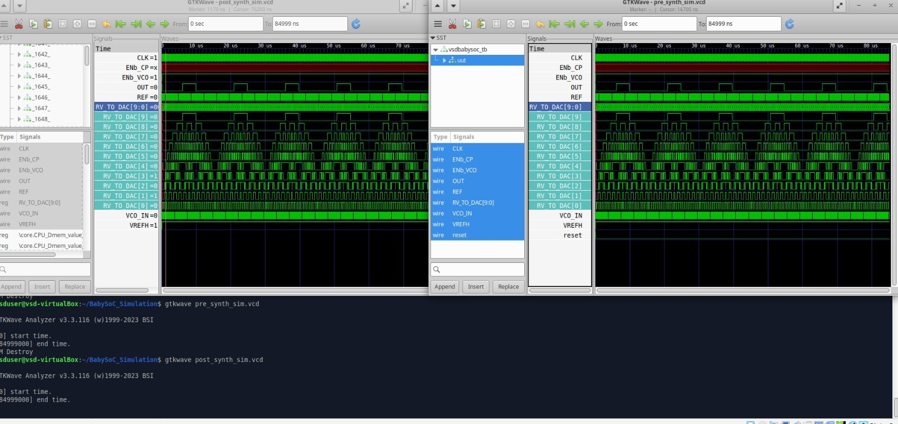

---

# Final Assessment – Sequence Detector

## 25. Sequence Detector

The final assessment focused on the design and verification of a sequence detector using Verilog HDL.

The target sequence was:

```text
1111100
```

The detector uses an FSM to track the incoming serial data and generate a detection pulse when the complete sequence is recognized.

Main signals:

```text
clk
reset
din
detected
state
```

---

## 26. Sequence Detector RTL Simulation

The sequence detector RTL was simulated using Icarus Verilog.

The generated waveform was viewed using GTKWave to verify the FSM state transitions and detection behavior.

### Screenshot

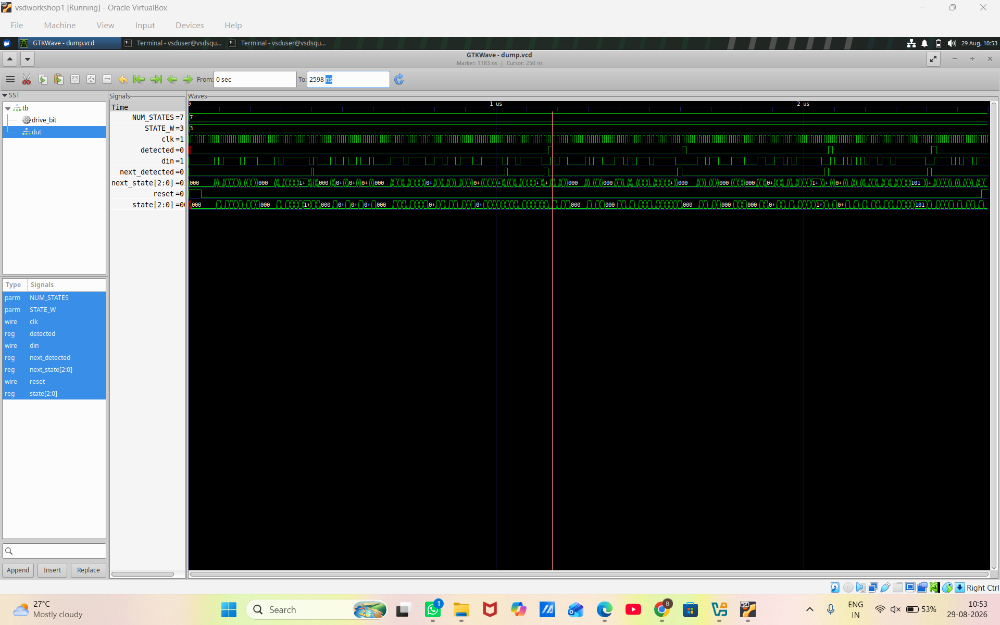

---

## 27. Sequence Detector Synthesis

The sequence detector was synthesized using Yosys.

The synthesized circuit was inspected to understand the hardware generated from the RTL description.

### Screenshot


---

## 28. Sequence Detector Gate-Level Verification

The synthesized sequence detector was verified using a post-synthesis / gate-level simulation.

The waveform was observed using GTKWave to verify that the synthesized implementation maintains the intended functionality.

### Screenshot

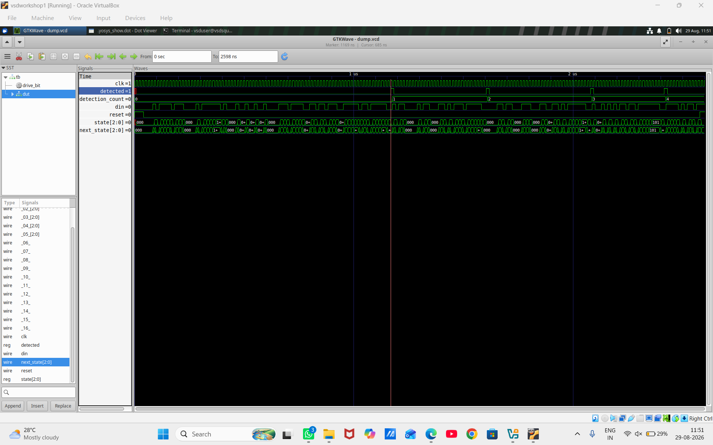
---

# Sequence Detector FSM Concept

The detector tracks the incoming bits and changes state according to the matched portion of the target sequence.

Target:

```text
1 → 1 → 1 → 1 → 1 → 0 → 0
```

Conceptual operation:

```text
Start
  ↓
1
  ↓
11
  ↓
111
  ↓
1111
  ↓
11111
  ↓
111110
  ↓
1111100
  ↓
Detection
```

When the complete sequence is recognized:

```text
detected = 1
```

---

# Sequence Detector Assessment Parameters

| Parameter       | Value          |
| --------------- | -------------- |
| Target Sequence | `1111100`      |
| Input           | `din`          |
| Clock           | `clk`          |
| Reset           | `reset`        |
| Output          | `detected`     |
| FSM State       | `state`        |
| Simulation      | Icarus Verilog |
| Waveform Viewer | GTKWave        |

The waveform was used to verify:

* Target sequence detection
* FSM state transitions
* Clock behavior
* Reset behavior
* Detection pulse
* Correct sequence-detector operation

---

# Important Yosys Commands

The following commands were used during the laboratory work:

```bash
yosys
```

```bash
read_verilog <file.v>
```

```bash
read_liberty -lib <library.lib>
```

```bash
synth -top <top_module>
```

```bash
dfflibmap -liberty <library.lib>
```

```bash
abc -liberty <library.lib>
```

```bash
opt
```

```bash
show
```

```bash
flatten
```

```bash
setundef -zero
```

```bash
clean -purge
```

```bash
rename -enumerate
```

```bash
stat
```

```bash
write_verilog -noattr <netlist.v>
```

---


# Final Practical Flow

The complete practical flow covered during the laboratory work can be summarized as:

```text
Verilog RTL
     ↓
GVim / VI
     ↓
Testbench
     ↓
Icarus Verilog
     ↓
Functional Simulation
     ↓
GTKWave
     ↓
Yosys
     ↓
RTL Synthesis
     ↓
Logic Optimization
     ↓
Technology Mapping
     ↓
SKY130 Standard Cells
     ↓
Gate-Level Netlist
     ↓
Gate-Level Simulation
     ↓
GTKWave Verification
     ↓
VSD BabySoC
     ↓
Pre-Synthesis Simulation
     ↓
Synthesis
     ↓
Post-Synthesis Simulation
     ↓
Sequence Detector Assessment
```
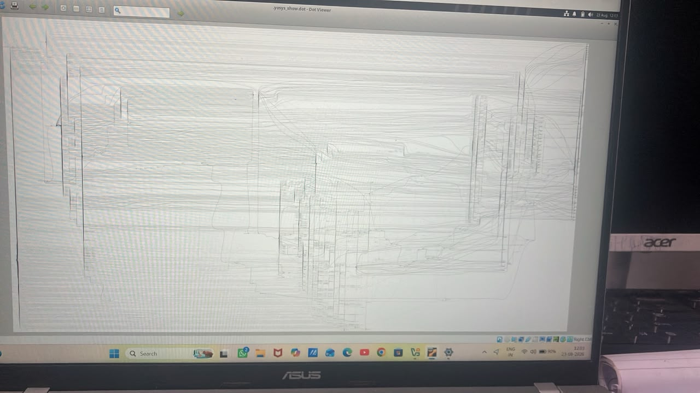
---

# Conclusion

The VLSI Design and Synthesis laboratory provided practical exposure to the complete RTL-to-gate-level design and verification flow.

The work covered Verilog RTL coding, functional simulation, GTKWave waveform analysis, Yosys synthesis, logic optimization, technology mapping, SKY130 standard-cell based design and Gate-Level Simulation.

The Good MUX and Bad MUX experiments demonstrated the importance of proper RTL coding and combinational logic design. Hierarchical RTL, sequential logic, counters, synthesis and technology mapping concepts were also studied.

The VSD BabySoC experiment extended the same design flow to a larger practical System-on-Chip design. Pre-synthesis simulation, synthesis, optimization, technology mapping and post-synthesis verification were performed.

The final assessment involved designing and verifying a 7-bit sequence detector for:

```text
1111100
```

using an FSM. The design was simulated using Icarus Verilog and verified using GTKWave.

Overall, the laboratory demonstrated the practical progression:

```text
RTL DESIGN
    ↓
FUNCTIONAL SIMULATION
    ↓
GTKWAVE
    ↓
YOSYS SYNTHESIS
    ↓
OPTIMIZATION
    ↓
TECHNOLOGY MAPPING
    ↓
GATE-LEVEL NETLIST
    ↓
GLS
    ↓
WAVEFORM VERIFICATION
    ↓
VSD BABYSOC
    ↓
PRE-SYNTHESIS SIMULATION
    ↓
POST-SYNTHESIS SIMULATION
    ↓
SEQUENCE DETECTOR ASSESSMENT
```
Now Chip Is Ready for Physical Design

---

**Author:** B. Rohith Reddy
**Department:** Electronics and Communication Engineering (ECE)
**Institution:** Anurag University
