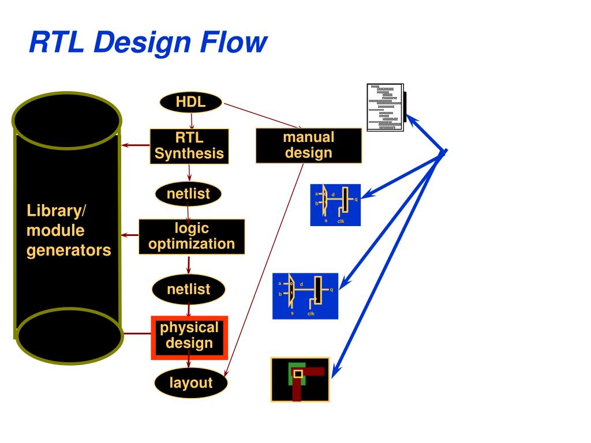
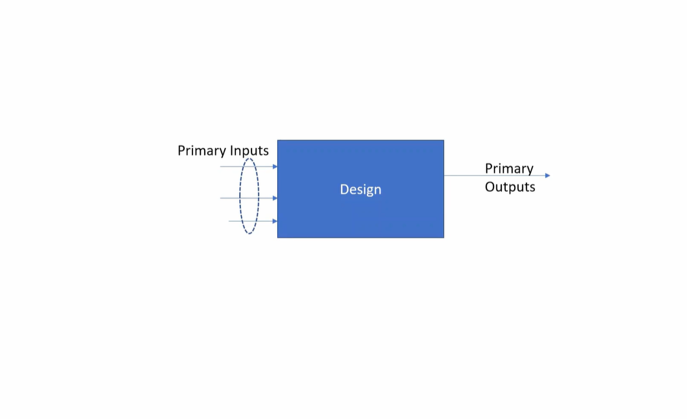
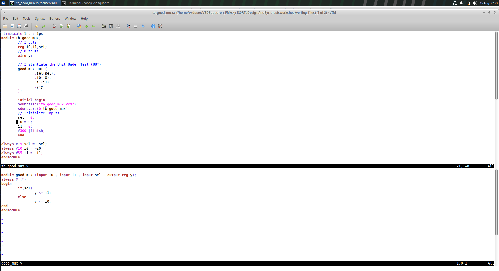
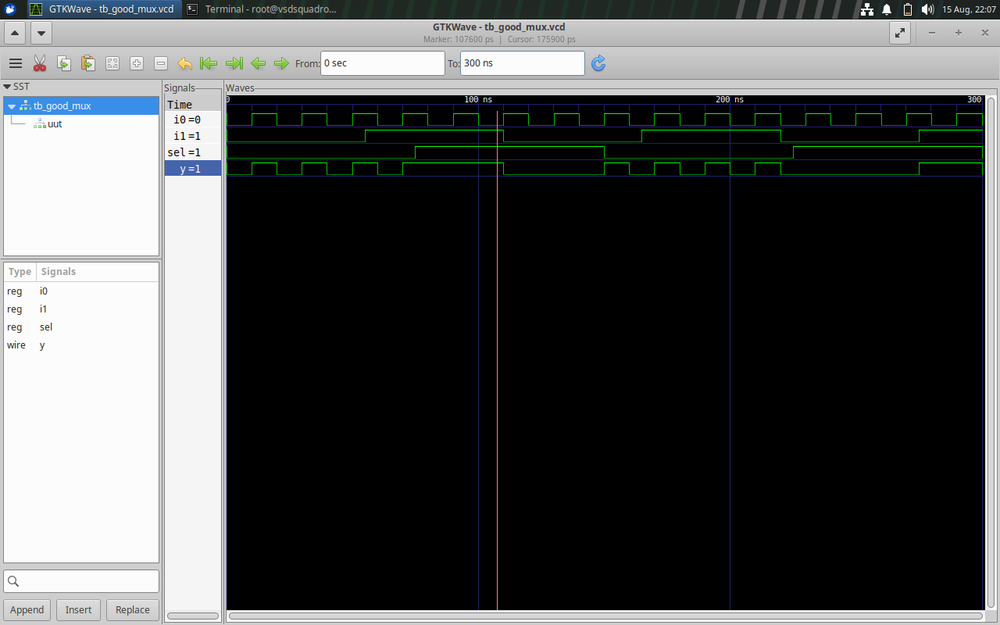

# Module 1: Introduction to Verilog RTL Design & Simulation

## 📌 Overview

This module provides an introduction to **RTL (Register Transfer Level) design using Verilog HDL**. The main objective is to understand the basic RTL design flow, create a Verilog design and testbench, simulate the design using **Icarus Verilog**, analyze the waveform using **GTKWave**, and understand the basics of **RTL synthesis using Yosys**.

The practical implementation is demonstrated using a **2:1 Multiplexer**.

---

# 1. RTL Design Flow

RTL design describes the functionality of digital hardware using a Hardware Description Language such as Verilog.

The basic flow followed in this module is:

```text
Verilog RTL Design
        ↓
    Testbench
        ↓
 Icarus Verilog
        ↓
    Simulation
        ↓
    VCD File
        ↓
    GTKWave
        ↓
 Waveform Analysis
        ↓
      Yosys
        ↓
     Synthesis
```

### 📸 RTL Simulation Flow



> *Figure 1: Basic RTL design and simulation flow.*

---

# 2. Design and Testbench

## Design

The **design** is the Verilog RTL code that describes the required hardware functionality.

For this module, a **2:1 Multiplexer** is used as the design example.

### 📸 Design



> *Figure 2: RTL design of the 2:1 Multiplexer.*

## Testbench

A **testbench** is used to verify the functionality of the design by applying different input combinations and observing the output.

The testbench acts as the verification environment for the Design Under Test (DUT).

### 📸 Testbench


> *Figure 3: Testbench used for verification of the 2:1 Multiplexer.*

---

# 3. 2:1 Multiplexer

A 2:1 Multiplexer selects one of two inputs based on a select signal.

### Inputs

* `i0` – Input 0
* `i1` – Input 1
* `sel` – Select signal

### Output

* `y` – Multiplexer output

### Logic

```text
if sel = 0 → y = i0
if sel = 1 → y = i1
```

### Truth Table

| Select | Output |
| ------ | ------ |
| 0      | i0     |
| 1      | i1     |

---

# 4. Verilog RTL Code

The 2:1 Multiplexer is described using Verilog HDL.

```verilog
module good_mux (
    input i0,
    input i1,
    input sel,
    output reg y
);

always @(*) begin
    if (sel == 1'b0)
        y = i0;
    else
        y = i1;
end

endmodule
```

### 📸 Verilog Code



> *Figure 4: Verilog RTL code for the 2:1 Multiplexer.*

---

# 5. Icarus Verilog

**Icarus Verilog** is an open-source Verilog simulator used to compile and simulate RTL designs.

The design and testbench are compiled using:

```bash
iverilog good_mux.v tb_good_mux.v
```

The generated simulation is executed using:

```bash
./a.out
```

The simulation produces a **VCD (Value Change Dump)** file containing signal changes during simulation.

### 📸 Icarus Verilog


> *Figure 5: Verilog compilation and simulation using Icarus Verilog.*

---

# 6. GTKWave

**GTKWave** is a waveform viewer used to analyze the output of a digital simulation.

The generated VCD file can be opened using:

```bash
gtkwave tb_good_mux.vcd
```

The waveform displays the values of signals such as:

* `i0`
* `i1`
* `sel`
* `y`

The waveform confirms that the output follows the selected input.

### 📸 GTKWave


> *Figure 6: GTKWave waveform showing the 2:1 Multiplexer simulation.*

---

# 7. Introduction to Yosys

**Yosys** is an open-source framework used for **RTL synthesis**.

Synthesis converts the RTL description into a hardware-oriented representation.

The basic Yosys flow is:

```text
Verilog RTL
    ↓
Read Design
    ↓
Process RTL
    ↓
Optimize
    ↓
Synthesize
    ↓
Netlist
```

### 📸 Yosys Setup


> *Figure 7: Yosys synthesis environment setup.*

---

# 8. Yosys Synthesis

The Verilog design can be loaded into Yosys using:

```bash
read_verilog good_mux.v
```

The top-level module can be selected using:

```bash
hierarchy -top good_mux
```

The RTL can then be processed and optimized using synthesis commands.

Yosys converts the behavioral RTL description into a hardware representation suitable for further implementation.

### 📸 Yosys Synthesizer


> *Figure 8: RTL synthesis using Yosys.*

---

# 9. What is a Library?

In VLSI design, a **cell library** contains information about standard cells used for implementing digital circuits.

A standard-cell library may contain cells such as:

* AND gates
* OR gates
* NOT gates
* NAND gates
* NOR gates
* Flip-flops
* Multiplexers

The library provides information about the cells, including their functionality and characteristics.

---

# 10. Library-Based Synthesis

During technology mapping, the synthesized RTL logic can be mapped to cells available in a specific technology library.

The basic concept is:

```text
RTL Design
    ↓
RTL Synthesis
    ↓
Logic Representation
    ↓
Technology Mapping
    ↓
Standard Cell Library
    ↓
Gate-Level Netlist
```

### 📸 Library Synthesis Illustration


> *Figure 9: Concept of library-based synthesis and technology mapping.*

---

# 11. Simulation vs Synthesis

| Simulation                   | Synthesis                                  |
| ---------------------------- | ------------------------------------------ |
| Checks functionality         | Converts RTL into hardware logic           |
| Uses RTL + Testbench         | Uses RTL                                   |
| Produces waveforms           | Produces netlist                           |
| Icarus Verilog               | Yosys                                      |
| GTKWave is used for analysis | Library can be used for technology mapping |

---

# 12. Observations

* Understood the basic RTL design flow.
* Created a 2:1 Multiplexer using Verilog HDL.
* Understood the role of a testbench.
* Compiled and simulated the RTL using Icarus Verilog.
* Generated and analyzed VCD waveforms using GTKWave.
* Understood the basic concept of RTL synthesis.
* Set up and explored Yosys.
* Understood the role of libraries in technology mapping and synthesis.

---

# 13. Learning Outcomes

After completing this module, I understood:

* Fundamentals of RTL design.
* Basic Verilog HDL structure.
* Design and testbench concepts.
* Simulation using Icarus Verilog.
* Waveform analysis using GTKWave.
* Basics of RTL synthesis using Yosys.
* The purpose of standard-cell libraries.
* The overall RTL-to-synthesis flow.

---

# 14. Conclusion

This module provided a practical introduction to the **Verilog RTL design flow**. A 2:1 Multiplexer was designed and verified using a testbench, Icarus Verilog and GTKWave. The module also introduced Yosys and the basic concepts of RTL synthesis and library-based technology mapping.

The complete flow understood during the module is:

**RTL Design → Testbench → Simulation → GTKWave → Synthesis → Library/Technology Mapping**
