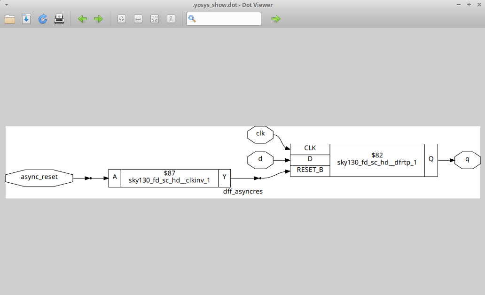
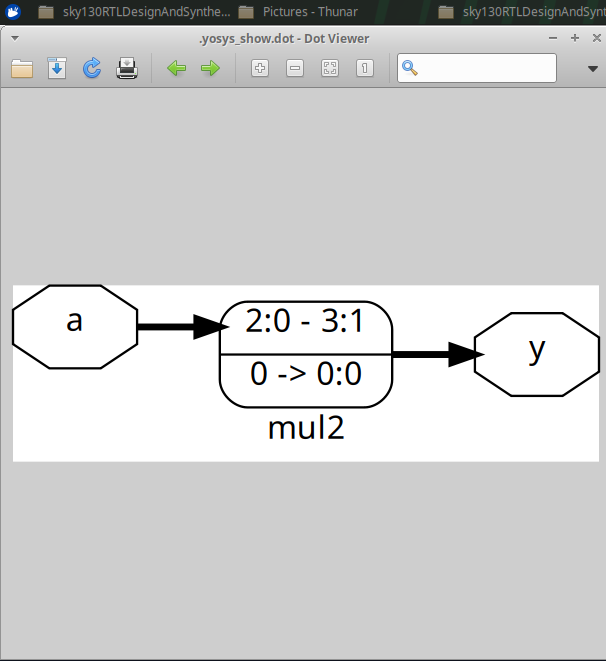

# Module 2 – Sequential Logic, Hierarchical Design and RTL Synthesis

## Overview

This module focuses on sequential RTL design, simulation, synthesis, hierarchical design, and netlist generation using Verilog, Icarus Verilog, GTKWave, and Yosys with the SKY130 standard-cell library.

---

## 1. D Flip-Flop Designs

Three different D Flip-Flop configurations were implemented and verified:

* D Flip-Flop with synchronous reset
* D Flip-Flop with asynchronous set
* D Flip-Flop with asynchronous reset

The designs were simulated using Icarus Verilog and verified using GTKWave.

---

### 1.1 D Flip-Flop with Synchronous Reset

A synchronous reset affects the output only at the active edge of the clock.

```verilog
module dff_syncres (
    input clk,
    input async_reset,
    input sync_reset,
    input d,
    output reg q
);

always @(posedge clk)
begin
    if (sync_reset)
        q <= 1'b0;
    else
        q <= d;
end

endmodule
```

---

### 1.2 D Flip-Flop with Asynchronous Set

An asynchronous set can force the output to logic 1 independently of the clock.

```verilog
module dff_async_set (
    input clk,
    input async_set,
    input d,
    output reg q
);

always @(posedge clk, posedge async_set)
begin
    if (async_set)
        q <= 1'b1;
    else
        q <= d;
end

endmodule
```

### Asynchronous Set Waveform

** – Asynchronous Set Waveform**

![Asynchronous Set Waveform]!(asyncsetwave-1.png)


### Asynchronous Set Diagram

** – Asynchronous Set Synthesized Diagram**


---

### 1.3 D Flip-Flop with Asynchronous Reset

An asynchronous reset can force the output to logic 0 independently of the clock.

```verilog
module dff_asyncres (
    input clk,
    input async_reset,
    input d,
    output reg q
);

always @(posedge clk, posedge async_reset)
begin
    if (async_reset)
        q <= 1'b0;
    else
        q <= d;
end

endmodule
```

### Asynchronous Reset Waveform

** – Asynchronous Reset Waveform**


![Asynchronous Reset Waveform]!(asyncsetwave-2.png)


### Asynchronous Reset Diagram

**– Asynchronous Reset Synthesized Diagram**





---

## 2. RTL Simulation

The D Flip-Flop designs were simulated using Icarus Verilog and the generated waveforms were verified using GTKWave.

Example simulation command:

```bash
iverilog dff_asyncres.v tb_dff_asyncres.v
./a.out
gtkwave tb_dff_asyncres.vcd
```

Similar commands were used for the synchronous reset and asynchronous set designs.

---

## 3. RTL Synthesis Using Yosys

After functional verification, the RTL designs were synthesized using Yosys.

The SKY130 standard-cell Liberty library was loaded before synthesis.

```bash
read_liberty -lib ../lib/sky130_fd_sc_hd__tt_025C_1v80.lib
read_verilog dff_syncres.v
synth -top dff_syncres
dfflibmap -liberty ../lib/sky130_fd_sc_hd__tt_025C_1v80.lib
abc -liberty ../lib/sky130_fd_sc_hd__tt_025C_1v80.lib
show
write_verilog -noattr dff_syncres_net.v
```

The synthesized design was mapped to cells from the SKY130 standard-cell library.

---

# 4. Multiplier Designs

Simple multiplier circuits were implemented using Verilog RTL and synthesized using Yosys.

## 4.1 Multiplier by 2

The input is a 3-bit signal and the output is a 4-bit signal.

```verilog
module mul2 (
    input [2:0] a,
    output [3:0] y
);

assign y = a * 2;

endmodule
```

### Synthesized Multiplier by 2

**– Multiplier by 2 Synthesized Diagram**





The synthesized implementation is optimized to wiring, with the input bits connected to the higher output bits and the least significant output bit tied to zero.

---

## 4.2 Multiplier by 8

The input is a 3-bit signal and the output is a 6-bit signal.

```verilog
module mult8 (
    input [2:0] a,
    output [5:0] y
);

assign y = a * 8;

endmodule
```

The synthesized implementation represents the required multiplication operation through the optimized hardware structure generated by Yosys.

---

# 5. Hierarchical Design

A hierarchical RTL design consists of multiple modules where a top-level module instantiates and connects lower-level submodules.

In this experiment:

* `sub_module1` performs an AND operation.
* `sub_module2` performs an OR operation.
* `multiple_modules` is the top-level module.

## 5.1 Submodule 1

```verilog
module sub_module1 (
    input a,
    input b,
    output y
);

assign y = a & b;

endmodule
```

## 5.2 Submodule 2

```verilog
module sub_module2 (
    input a,
    input b,
    output y
);

assign y = a | b;

endmodule
```

## 5.3 Top-Level Module

```verilog
module multiple_modules (
    input a,
    input b,
    input c,
    output y
);

wire net1;

sub_module1 u1 (
    .a(a),
    .b(b),
    .y(net1)
);

sub_module2 u2 (
    .a(net1),
    .b(c),
    .y(y)
);

endmodule
```

The resulting logic is:

```text
net1 = a & b
y    = net1 | c
```

Therefore:

```text
y = (a & b) | c
```

### Hierarchical Design Diagram

**–Multiple Modules / Hierarchical Design**


---

# 6. Hierarchical Synthesis

The multi-module design was synthesized using Yosys.

```bash
yosys
```

Load the SKY130 library:

```bash
read_liberty -lib ../lib/sky130_fd_sc_hd__tt_025C_1v80.lib
```

Read the Verilog design:

```bash
read_verilog multiple_modules.v
```

Synthesize the top-level module:

```bash
synth -top multiple_modules
```

Visualize the synthesized design:

```bash
show
```

Generate the hierarchical netlist:

```bash
write_verilog -noattr multiple_modules_netlist.v
```

The hierarchical design preserves the module structure and the connection through the intermediate signal `net1`.

---

# 7. Flat Synthesis

A hierarchical design can also be converted into a flat representation.

The Yosys `flatten` command removes the original module hierarchy and represents the complete logic at a single level.

```bash
flatten
show
```

Generate the flat netlist:

```bash
write_verilog -noattr multiple_modules_flat.v
```

The final logic remains:

```text
y = (a & b) | c
```

---

# 8. Hierarchical vs Flat Netlist

| Feature              | Hierarchical Netlist      | Flat Netlist                            |
| -------------------- | ------------------------- | --------------------------------------- |
| Module hierarchy     | Preserved                 | Removed                                 |
| Submodule instances  | Present                   | Removed                                 |
| Design structure     | Clearly visible           | Combined                                |
| Debugging            | Easier at module level    | More difficult for large designs        |
| Logic representation | Module-based              | Single-level                            |
| Optimization         | Module structure retained | Entire design can be optimized together |

---

# 9. What I Learned

* Difference between combinational and sequential logic
* Working principle of a D Flip-Flop
* Difference between synchronous and asynchronous reset
* Operation of an asynchronous set
* RTL simulation using Icarus Verilog
* Waveform verification using GTKWave
* RTL synthesis using Yosys
* Use of the SKY130 standard-cell Liberty library
* Flip-Flop technology mapping using `dfflibmap`
* Technology mapping using `abc`
* Generation of synthesized Verilog netlists
* Hierarchical RTL design using multiple modules
* Module instantiation and interconnection
* Difference between hierarchical and flat netlists
* Use of the `flatten` command in Yosys

---

# 10. Conclusion

This module provided practical experience with sequential RTL design, simulation, synthesis, hierarchical design, and netlist generation.

Different D Flip-Flop configurations were implemented and verified using Icarus Verilog and GTKWave. The designs were subsequently synthesized and technology-mapped using Yosys and the SKY130 standard-cell library.

Multiplier designs were also implemented and synthesized to observe their corresponding hardware representations.

Finally, a hierarchical multi-module design was synthesized while preserving its hierarchy and was then flattened to obtain a single-level representation.
