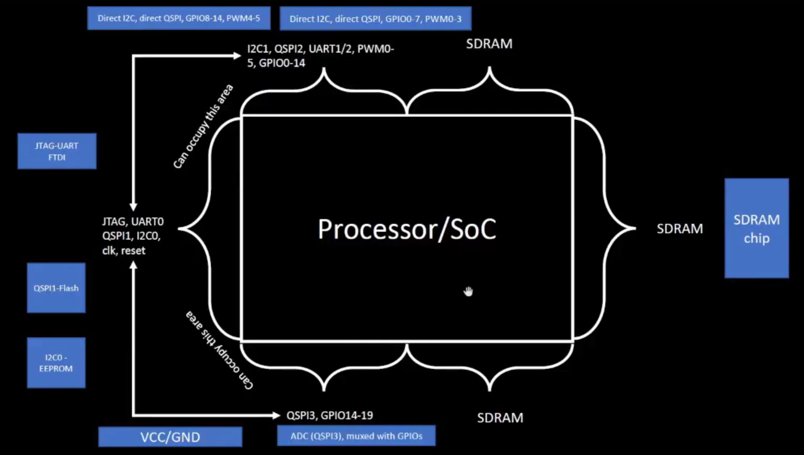
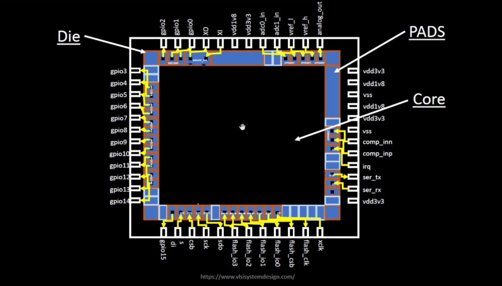
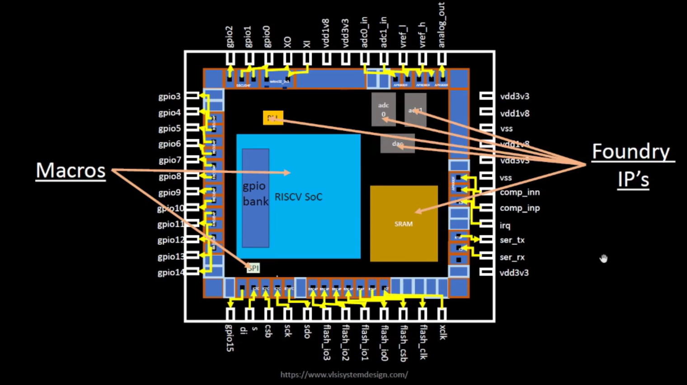
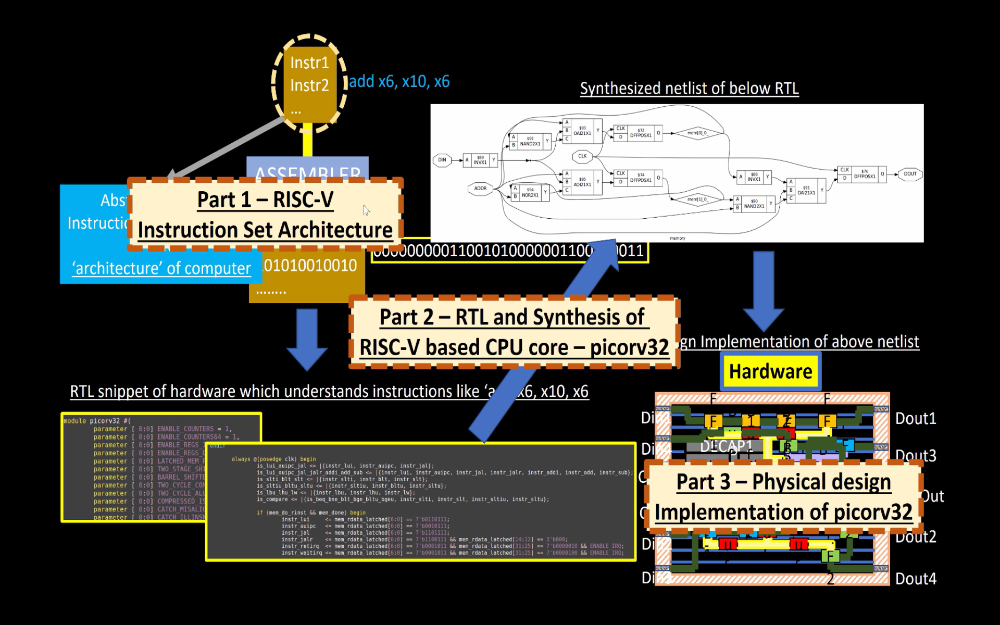
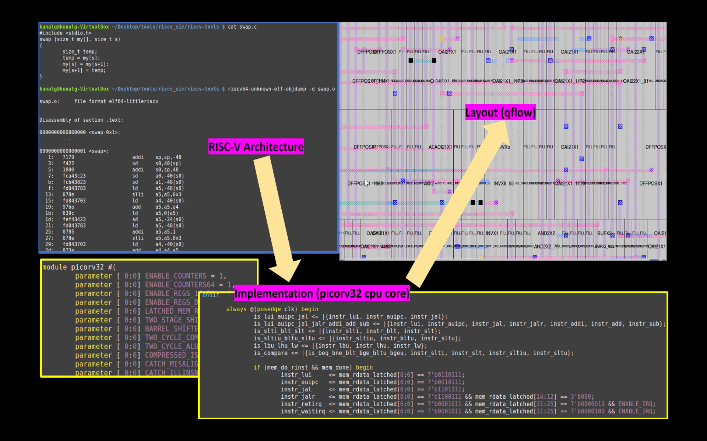
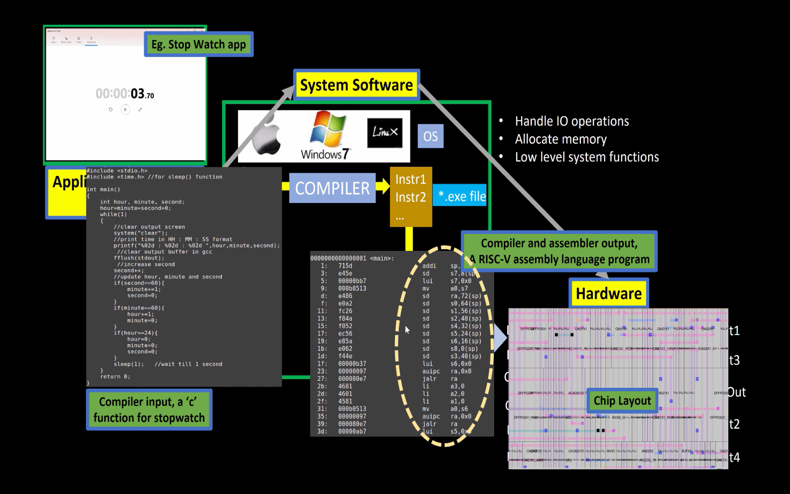
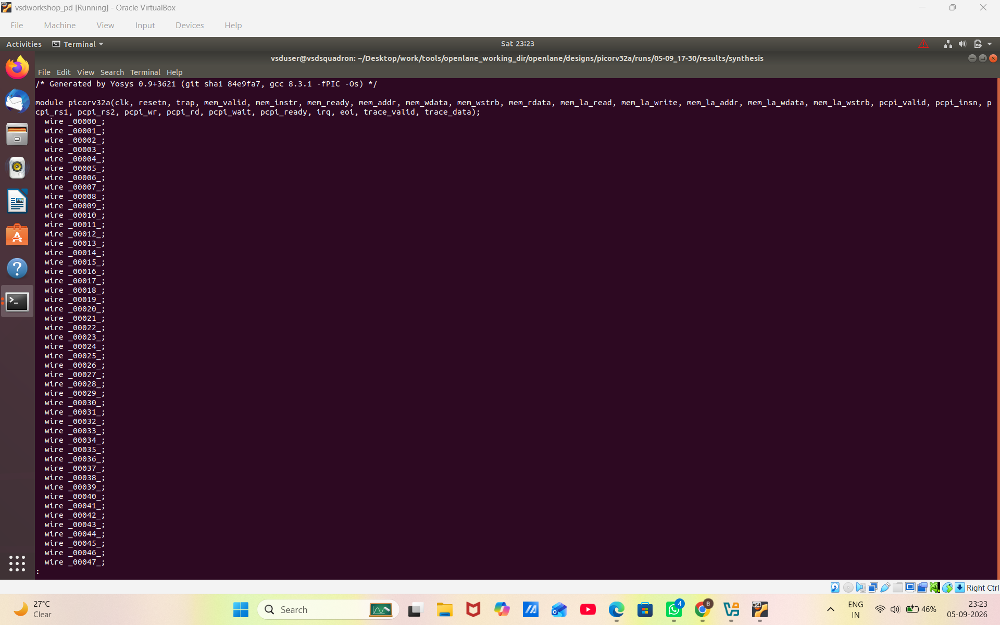
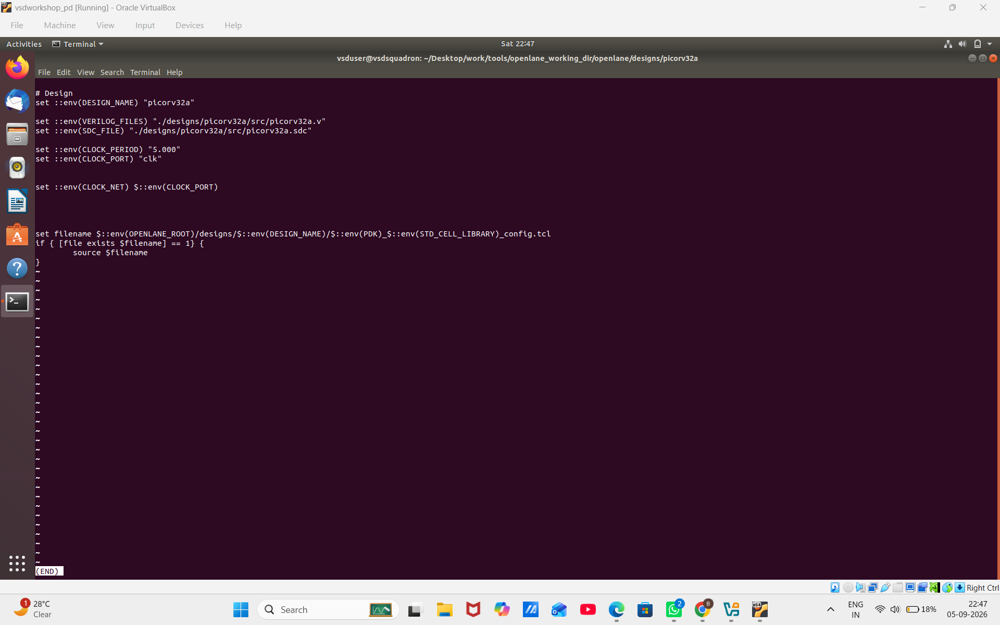
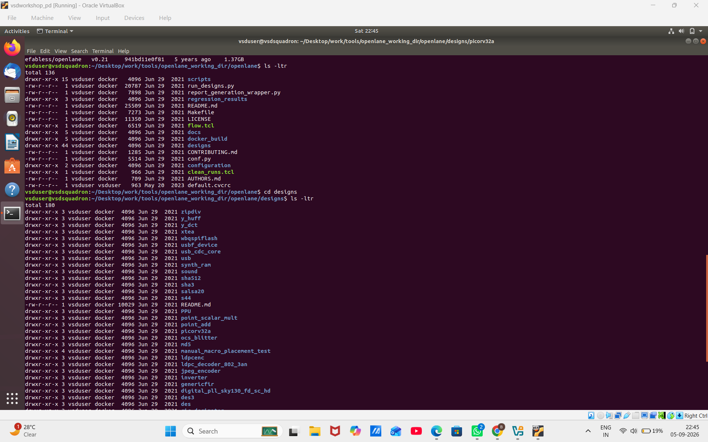

# Module 1 – Inception of Open-Source EDA, OpenLANE and SKY130 PDK

This module introduces the fundamentals of digital ASIC design and the open-source EDA ecosystem.

The module begins with understanding how computers communicate with hardware, starting from a processor on a development board and progressing through SoC architecture, chip packaging, pads, core, die, macros and foundry IPs. It then introduces RISC-V, HDL, and the transformation of software applications into hardware.

The module further covers PDKs, the SKY130 technology node, the ASIC design flow, the RTL-to-GDSII flow, OpenLANE, and the StriVe SoC family. The final part includes practical exploration of the OpenLANE environment, PicoRV32 design files, synthesis results, and configuration files.

---

## 📚 Topics Covered

* How Computers Talk to Hardware
* Processor on Arduino Board
* Processor and SoC Architecture
* Wirebond and Chip Pin Connections
* Pads and Core
* Die
* Macros and Foundry IPs
* Introduction to RISC-V ISA
* Hardware Description Language
* From Software Applications to Hardware
* Stopwatch Application Example
* What is a PDK?
* SKY130 Technology
* ASIC Design Flow
* Simplified RTL-to-GDSII Flow
* OpenLANE ASIC Design Flow
* StriVe SoC Family
* OpenLANE Directory Structure
* PicoRV32 Design
* Synthesis Results and Configuration Files

---

# 1. How Computers Talk to Hardware

Computers and digital systems communicate with hardware through processors and digital logic.

A software program contains instructions that are eventually converted into machine-level instructions. These instructions are understood and executed by a processor, which controls the connected hardware.

A development board provides a simple example of this concept. The board contains a processor or controller that receives instructions and interacts with different hardware components.

###  Arduino Board and Processor


---

# 2. Processor and SoC Architecture

A processor is the main computational unit responsible for executing instructions.

A **System-on-Chip (SoC)** combines a processor with other important components and interfaces on a single chip. These can include memory interfaces, communication interfaces, GPIO, storage and other peripherals.

The SoC architecture shown in the module demonstrates how the processor is connected to different external interfaces and components.

Examples include:

* JTAG
* UART
* QSPI
* GPIO
* SDRAM
* Flash
* EEPROM
* ADC

This integration of multiple functional blocks allows a complete electronic system to be implemented on a single chip.

###  Processor / SoC Architecture



---

# 3. Wirebond and Chip Pin Connections

A packaged IC must provide electrical connections between the silicon chip and the outside world.

The connections between the chip and package pins are made using interconnect structures such as wire bonds. These connections allow signals, power and ground to travel between the internal chip circuitry and external devices.

The chip package therefore acts as an interface between the semiconductor die and the external circuit.

###  Wirebond and Chip Connections


---

# 4. Pads and Core

The physical design of a chip is divided into different regions.

**Pads** are used to provide connections between the internal circuitry and external signals. They are placed around the functional design area and form the input/output interface of the chip.

The **core** is the main area where the functional logic of the design is implemented.

The core contains the digital logic and other functional blocks required to perform the intended operation of the chip.


# 5. Die

The **die** is the physical piece of semiconductor on which the complete circuit is fabricated.

The die contains the core, pads and other required structures.

A simplified hierarchy can be represented as:

```text
Package
   |
   v
Die
   |
   +-- Pads
   |
   +-- Core
          |
          +-- Functional Logic
          +-- Memories
          +-- Other Blocks
```

The size of the die depends on the amount of circuitry and the physical implementation requirements.

###  Die,Pads and Core Structure




---

# 6. Macros and Foundry IPs

A chip can contain different pre-designed functional blocks.

These blocks can include:

* **Macros**
* Memory blocks
* Reusable IP blocks
* Foundry-provided IPs

An **IP (Intellectual Property)** block is a reusable design component that can be integrated into a larger chip.

**Macros** are larger pre-designed blocks used within the chip design.

Foundry IPs provide technology-specific components that can be used while designing an ASIC using a particular fabrication technology.

The screenshot illustrates the relationship between the chip, core, macros and foundry IP blocks.

### Macros and Foundry IPs


---

# 7. Introduction to RISC-V ISA

**RISC-V** is an open Instruction Set Architecture (ISA).

The ISA defines the instructions that a processor can understand and execute.

The relationship between software and a processor can be represented as:

```text
Software Program
       |
       v
Instructions
       |
       v
Instruction Set Architecture
       |
       v
Processor
       |
       v
Hardware Operations
```

RISC-V provides an open architecture that can be used to design different processor implementations.

### Introduction to RISC-V ISA


---

# 8. Hardware Description Language

Digital hardware can be described using a **Hardware Description Language (HDL)**.

HDL allows the behavior and structure of digital circuits to be represented using code.

The RTL description can represent components such as:

* Combinational logic
* Sequential logic
* Registers
* Counters
* State machines
* Processor components

The RTL is then processed through synthesis tools to generate a gate-level representation of the design.

The module connects the RISC-V architecture with its RTL implementation and the later stages of the ASIC design flow.

###  RISC-V and RTL Implementation


---

# 9. From Software Applications to Hardware

A software application is written using a high-level programming language.

The application cannot directly operate as transistor-level hardware. It must first be converted into instructions that can be understood by the processor.

The basic transformation is:

```text
Application
     |
     v
High-Level Program
     |
     v
Compiler
     |
     v
Assembly / Machine Instructions
     |
     v
Processor
     |
     v
Hardware
```

The processor executes the generated instructions according to its Instruction Set Architecture.

This creates the connection between software applications and the underlying digital hardware.

###  Software Application to Hardware

.png>)

---

# 10. Stopwatch Application Example

The stopwatch example demonstrates how a software application is connected to the processor hardware.

The application is written as a program and processed through the software toolchain.

The compiler and related tools convert the program into instructions that can be executed by the processor.

The overall concept is:

```text
Stopwatch Application
        |
        v
Source Program
        |
        v
Compiler
        |
        v
Assembly / Machine Code
        |
        v
RISC-V Processor
        |
        v
Hardware Execution
```

This example helps explain how an application eventually becomes a sequence of instructions executed by hardware.

###  Stopwatch Application and RISC-V Instructions


---

# 11. What is a PDK?

A **Process Design Kit (PDK)** provides the technology information required to design and manufacture integrated circuits using a particular semiconductor process.

The PDK acts as an interface between the design tools and the semiconductor manufacturing technology.

It provides technology-specific information required during the design flow.

The PDK is used by EDA tools during stages such as:

* Synthesis
* Floorplanning
* Placement
* Routing
* Timing analysis
* Physical verification

The module introduces the PDK concept as an important part of the digital ASIC design ecosystem.

---

# 12. SKY130 Technology

**SKY130** refers to the open-source process design ecosystem based on SkyWater's 130 nm technology.

The **130 nm** value refers to the technology node associated with the manufacturing process.

Although newer semiconductor technologies use smaller nodes, 130 nm technology remains highly useful for education, research, open-source ASIC development and many other applications.

The SKY130 ecosystem provides technology information and libraries that can be used with open-source EDA tools.

It enables practical experimentation with a complete ASIC design flow.


---

# 13. ASIC Design Flow

An **ASIC (Application-Specific Integrated Circuit)** is designed to perform specific functions.

The digital ASIC design process starts with a hardware description and progresses through several stages until a physical layout is generated.

The major stages introduced in the design flow include:

1. RTL Design
2. Synthesis
3. Static Timing Analysis
4. Floorplanning
5. Power Planning
6. Placement
7. Clock Tree Synthesis
8. Routing
9. Physical Verification
10. GDSII Generation

Each stage transforms the design and prepares it for the next step of the ASIC implementation flow.


# 14. Simplified RTL-to-GDSII Flow

The RTL-to-GDSII flow converts a hardware design written at the RTL level into a physical layout suitable for fabrication.

The simplified flow is:

```text
RTL
 |
 v
Synthesis
 |
 v
Floor Planning + Power Planning
 |
 v
Placement
 |
 v
Clock Tree Synthesis
 |
 v
Routing
 |
 v
Sign-Off
 |
 v
GDSII
```

The RTL describes the functionality of the circuit, while the final GDSII represents the physical layout data generated after the implementation flow.

The technology-specific information required during this process is provided by the PDK.

###  Simplified RTL-to-GDSII Flow


---

# 15. OpenLANE ASIC Design Flow

**OpenLANE** is an open-source ASIC implementation flow that automates different stages of the RTL-to-GDSII process.

It integrates open-source EDA tools and the required technology information to perform ASIC implementation.

The OpenLANE flow includes different stages such as:

* RTL Synthesis
* Static Timing Analysis
* Floorplanning
* Power Distribution Network Generation
* Placement
* Clock Tree Synthesis
* Routing
* Physical Verification
* Final Layout Generation

OpenLANE provides an open-source environment for understanding and executing the digital ASIC design flow.

###  OpenLANE ASIC Flow

---

# 16. StriVe SoC Family

The **StriVe SoC family** demonstrates open-source SoC implementations developed using the open-source ASIC design ecosystem.

The module introduces different StriVe variants and their implementation features.

The examples shown include:

* StriVe
* StriVe2
* StriVe2a
* StriVe3
* StriVe5
* StriVe6

These designs demonstrate how processor cores, memories and other components can be integrated to create complete SoCs.

###  StriVe SoC Family


---

# 17. Practical Work PicoRV32 Synthesis

The practical part of the module introduces the OpenLANE environment using the **PicoRV32** design.

PicoRV32 is used as the example design for exploring the synthesis process and generated design files.

During synthesis, the RTL design is converted into a gate-level representation using cells from the selected technology library.

The synthesis results provide information about the generated design.

###  PicoRV32 Synthesis Statistics


---

# 18. OpenLANE Results and Synthesized Netlist

After running synthesis, OpenLANE generates output directories, reports and design files.

The synthesized netlist represents the RTL functionality using technology-specific standard cells.

The practical work includes inspecting:

* Synthesis output files
* Generated reports
* Result directories
* Synthesized Verilog netlist

### OpenLANE Results Directory


---

# 19. SKY130 Library and OpenLANE Files

The practical work also includes examining technology and library-related files used during the design flow.

The SKY130 library provides technology-specific information and standard cells required by the design tools.

The OpenLANE environment contains the files and directories needed to manage the designs and execute the flow.

###  SKY130 Library / OpenLANE Files


---

# 20. OpenLANE Directory Structure

The OpenLANE environment contains multiple directories and files used for designs, scripts, configurations and generated results.

Understanding the directory structure helps in locating:

* Design directories
* Configuration files
* RTL source files
* Scripts
* Generated reports
* Synthesis results
* Technology-related files

###  OpenLANE Directory Structure


---

# 21. PicoRV32 Design Configuration

The PicoRV32 design contains configuration information required by OpenLANE.

The configuration identifies important design parameters such as:

```text
DESIGN_NAME
VERILOG_FILES
SDC_FILE
CLOCK_PERIOD
CLOCK_PORT
CLOCK_NET
STD_CELL_LIBRARY
```

These parameters help define the design source, timing information and technology library used during the flow.

###  PicoRV32 Configuration File


---

# 22. OpenLANE Design Environment

The final practical work shows the OpenLANE design environment and the organization of available design directories.

This demonstrates how a design such as PicoRV32 is organized within the OpenLANE environment along with its configuration and supporting files.

###  OpenLANE Designs Directory



---

# 🎯 Key Learning Outcomes

After completing Module 1, the following concepts were covered:

* How computers communicate with hardware
* Processor and SoC architecture
* Chip packaging and wirebond connections
* Pads, core and die
* Macros and foundry IPs
* Introduction to RISC-V ISA
* Hardware Description Language and RTL
* Transformation from software applications to hardware
* Stopwatch application example
* Process Design Kit (PDK)
* SKY130 technology
* ASIC design flow
* RTL-to-GDSII flow
* OpenLANE ASIC design flow
* StriVe SoC family
* PicoRV32 design
* OpenLANE directory structure
* RTL synthesis
* Synthesis results
* Synthesized netlist
* Design configuration files

---

# 🛠️ Tools and Technologies

* OpenLANE
* SKY130 PDK
* RISC-V
* PicoRV32
* Verilog / RTL
* Open-Source EDA Tools
* Digital ASIC Design Flow
* RTL-to-GDSII Flow


---

## 👨‍💻 Author

**Boda Rohith Reddy**

ECE / ANURAG UNIVERSITY
