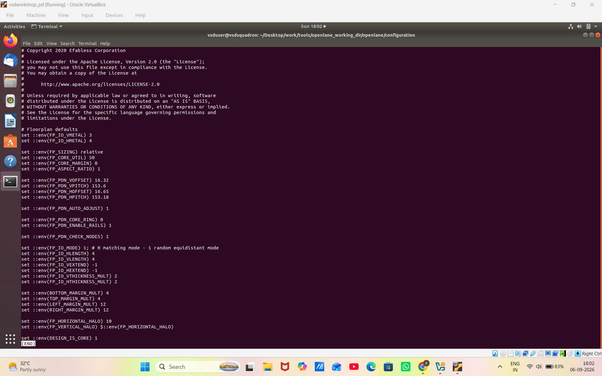
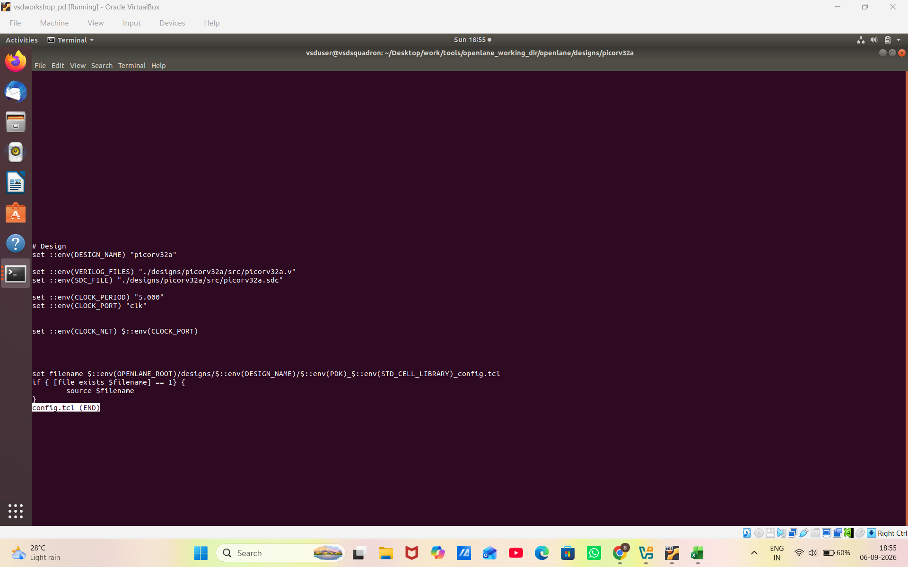
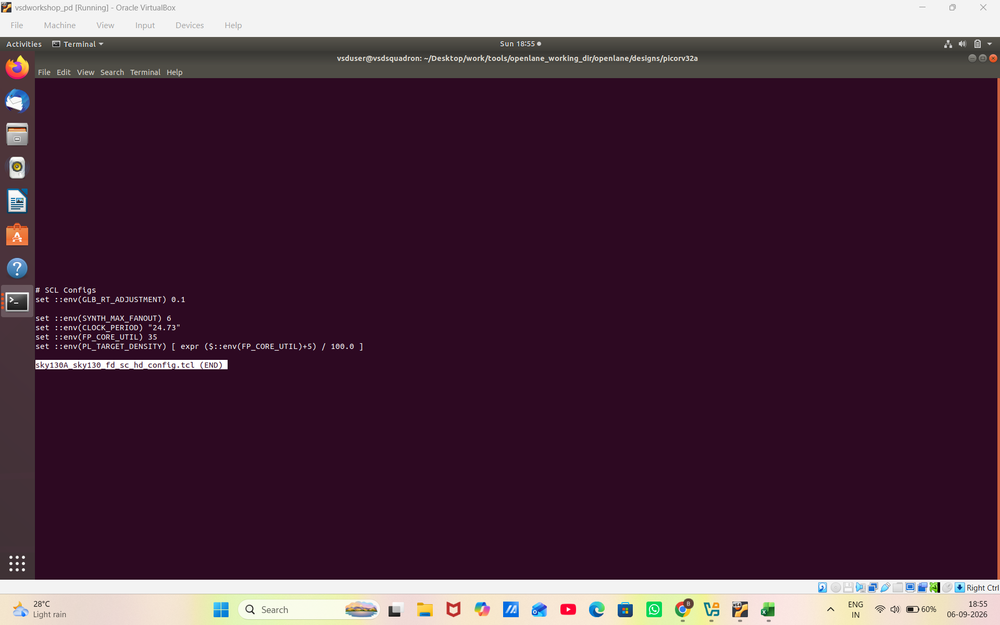
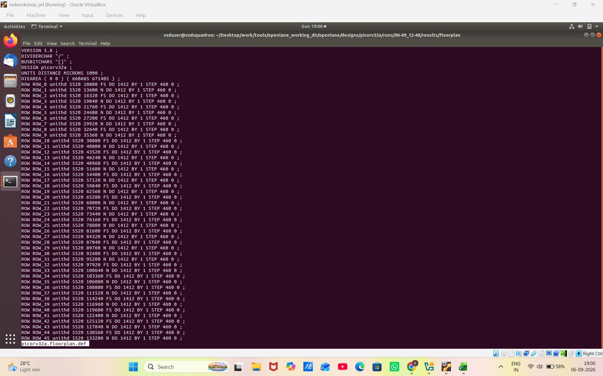
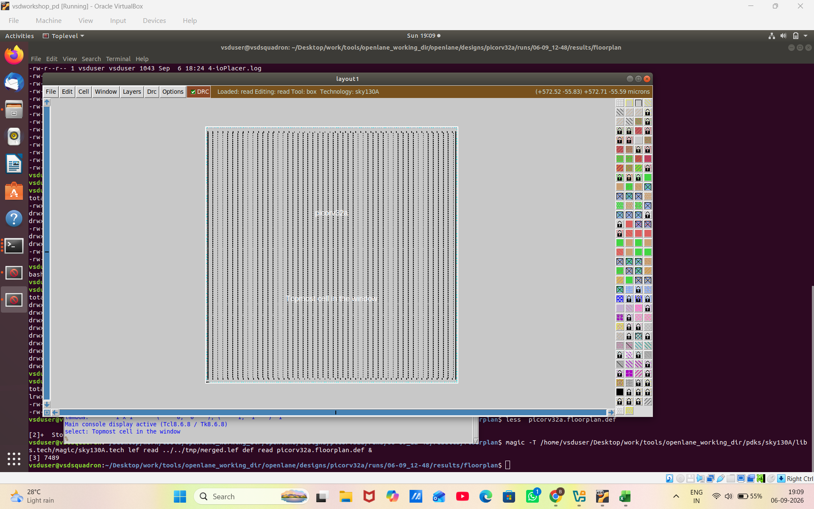
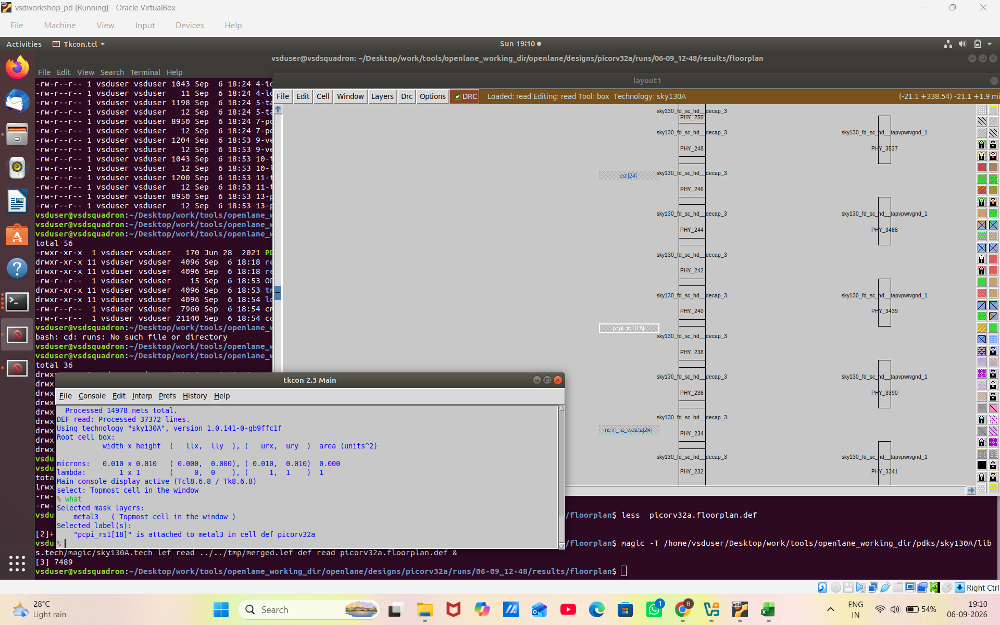
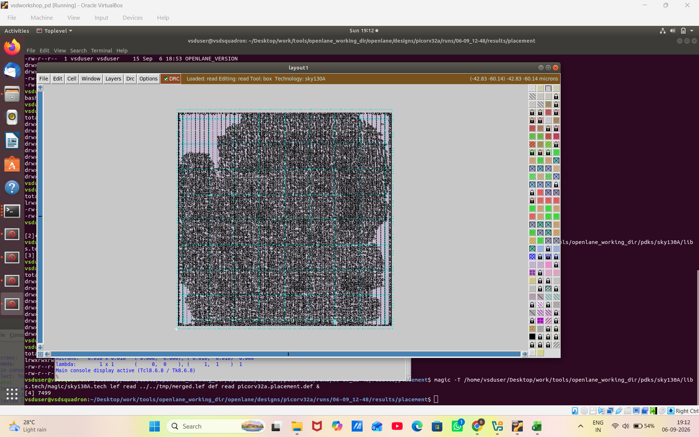
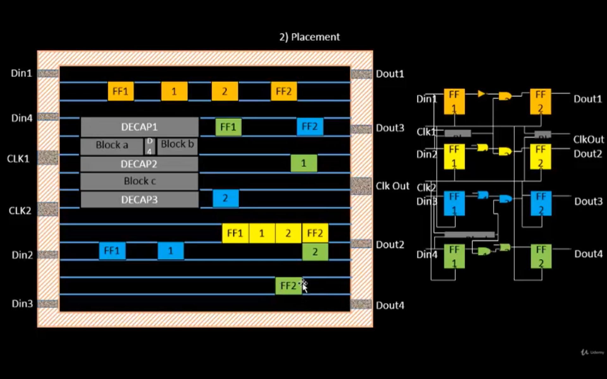

# Module 2 – Good Floor Plan vs Bad Floor Plan

This module focuses on the fundamentals of **ASIC physical design and floorplanning**. It covers the concepts of core and die dimensions, pre-placed cells, decoupling capacitors, power planning, pin placement, placement blockages, standard-cell placement, placement optimization, library characterization, cell design flow, characterization flow, timing thresholds, propagation delay, and transition time.

The module also includes practical lab work using the **PicoRV32 design, Sky130 technology, OpenLane physical design flow, and Magic layout viewer**.

---

## 1. Define Width and Height of Core and Die

The die represents the complete silicon area of the chip, while the core is the main region where the standard cells and other logic elements are placed.

The width and height of the core and die determine the physical dimensions of the design.

Important considerations include:

- Core width and height
- Die width and height
- Area utilization
- Available placement area
- Routing resources

### Core and Die Width & Height

---

## 2. Define Location of Pre-placed Cells

Pre-placed cells or blocks are physical blocks whose locations are determined before the standard-cell placement process.

These may include:

- Macros
- Memory blocks
- IP blocks
- Large functional blocks

Proper placement of these blocks is important to avoid routing congestion and timing problems.

###  Pre-placed Cells / Blocks

### Pre-placed Cells in Floorplan

The second diagram demonstrates the physical location of pre-placed blocks inside the core and their separation into different functional blocks or modules.

---

## 3. Surround Pre-placed Cells with Decoupling Capacitors

Decoupling capacitors (Decaps) are placed around pre-placed cells or macros to improve power integrity.

They provide local charge during sudden changes in current demand and help reduce voltage fluctuations.

Decoupling capacitors help in:

- Reducing power supply noise
- Improving voltage stability
- Reducing local voltage fluctuations
- Improving power integrity

###  Decoupling Capacitors

---

## 4. Power Planning

Power planning creates the power distribution network required to deliver supply voltage to different parts of the chip.

The power network distributes:

- VDD
- VSS

A good power plan helps maintain reliable power delivery and reduces problems such as IR drop and power noise.

### Power Planning

---

## 5. Pin Placement

Pin placement determines the physical locations of input and output pins around the core or die.

Good pin placement helps to:

- Reduce wire length
- Reduce routing congestion
- Improve timing
- Improve routing efficiency
- Maintain an organized physical design

### Pin Placement

---

## 6. Logical Cell Placement Blockage

A placement blockage is a physical region where standard cells are restricted or not allowed to be placed.

Placement blockages are used to:

- Protect macro regions
- Control cell density
- Reduce congestion
- Reserve routing resources
- Improve placement quality

### Logical Cell Placement Blockage

---

# Practical Lab Work

The following part demonstrates the practical implementation of the physical design flow using the **PicoRV32 design, Sky130 technology, OpenLane, and Magic**.

---

## 7. config.tcl

The configuration file contains the parameters required for running the physical design flow.

It defines important settings used by the design flow, including technology and design-related configuration parameters.

### config.tcl

---

## 8. Design – PicoRV32

PicoRV32 is a small RISC-V based processor core used as the design example in the physical design flow.

The design is processed through synthesis and physical implementation stages.

### PicoRV32 Design

---

## 9. Sky130A / Sky130 FC HD

The Sky130 technology and standard-cell library are used for implementing the design.

The technology information is required for synthesis and physical design.

### Sky130A Sky130 FC HD

---

## 10. PicoRV32A Floorplan

Floorplanning determines the physical organization of the design inside the core and die.

The floorplan contains the physical region where the design cells are placed.

### PicoRV32A Floorplan

---

## 11. Magic Floorplan

Magic is used as a layout viewing and inspection tool.

The floorplan can be viewed and inspected at the physical layout level.

### Magic Floorplan

---

## 12. Selected Metal 3

Different metal layers are used for routing signals and power connections in an integrated circuit.

This screenshot shows the Metal 3 layer selected in the physical layout.

### Selected Metal 3

---

## 13. Cell Layout

The cell layout represents the physical implementation of the standard cells and other layout structures.

The layout can be inspected using the Magic layout viewer.

### Cell Layout

---

## 14. Selected Mask Layer – Metal 2

Different mask layers represent different physical structures used during semiconductor fabrication.

This screenshot shows the Metal 2 mask layer selected in the layout.

### Selected Mask Layer Metal 2

---

## 15. Bind Netlist with Physical Cells

After synthesis, the design is represented as a logical netlist containing standard-cell instances and their connections.

For physical implementation, these logical cells must be associated with their corresponding physical standard-cell layouts from the technology library.

This allows the logical design to be represented physically.

### Bind Netlist with Physical Cells

---

## 16. Placement

Placement is the process of determining the physical locations of standard cells inside the core.

Placement considers:

- Cell connectivity
- Timing
- Area
- Routing congestion
- Power
- Physical constraints

The objective is to obtain a placement that can be routed efficiently.

### Placement

---

## 17. Optimise Placement

Placement optimization improves the quality of the initial placement.

The optimization process considers factors such as:

- Wire length
- Capacitance
- Timing
- Routing congestion
- Cell locations

The estimated wire length and capacitance can be used to determine where optimization or repeaters may be required.

### Optimize Placement

---

## 18. Library Characterization and Modelling

Library characterization determines the electrical and timing behavior of standard cells.

Characterization considers parameters such as:

- Input transition
- Output load
- Propagation delay
- Transition time
- Power
- Noise behavior

The characterization results are used to create models for the standard-cell library.

### Library Characterization and Modelling

---

## 19. Cell Design Flow

The cell design flow describes the physical implementation process of a standard cell.

A typical flow includes:

1. Cell specification
2. Circuit design
3. Layout design
4. Design-rule checking
5. Extraction
6. Characterization
7. Library/model generation

### Cell Design Flow

---

## 20. Cell Design Flow – Standard Cells

Standard-cell libraries contain different types of cells that provide different functionalities.

Examples include:

- AND gates
- OR gates
- Buffers
- Inverters
- Latches
- Flip-flops
- Logic cells

Standard cells can have different sizes, functionality, and transistor characteristics.

### Cell Design Flow / Standard Cells

---

## 21. Characterisation Flow

The characterization flow is used to determine the electrical and timing behavior of a standard cell.

A test circuit is used to apply an input stimulus and observe the output response.

The characterization process provides information required for generating timing and power models.

### Characterisation Flow

---

## 22. Timing Threshold

Timing measurements are performed using defined voltage thresholds.

Common timing threshold parameters include:

- `slew_low_rise_thr`
- `slew_high_rise_thr`
- `slew_low_fall_thr`
- `slew_high_fall_thr`
- `in_rise_thr`
- `in_fall_thr`
- `out_rise_thr`
- `out_fall_thr`

These thresholds provide consistent reference points for measuring signal transitions and delays.

### Timing Threshold

---

## 23. Propagation Delay

Propagation delay is the time difference between a specified transition at the input and the corresponding transition at the output.

It is an important timing parameter used to determine the speed of a digital cell.

Propagation delay is measured using defined input and output timing thresholds.

### Propagation Delay

---

## 24. Transition Time

Transition time is the time required for a signal to move between specified voltage thresholds.

It can be measured for:

- Rising transition
- Falling transition
- Input and output slew values

Input and output slew values are important parameters in timing characterization.

### Transition Time

---

# 🛠️ Tools and Technologies

The module involves the following tools and technologies:

- ASIC Physical Design
- Floorplanning
- PicoRV32
- RISC-V based processor design
- Sky130 Technology
- Sky130 Standard-Cell Library
- OpenLane
- Magic
- Standard Cells
- Metal Layers
- Physical Layout
- Library Characterization
- Timing Characterization

---

# 🎯 Learning Outcomes

After completing this module, the following concepts are understood:

- Difference between core and die
- Core and die dimensions
- Location of pre-placed cells
- Decoupling capacitors
- Power planning
- Pin placement
- Logical cell placement blockages
- Physical implementation of PicoRV32
- Sky130 technology setup
- Floorplanning
- Magic layout visualization
- Metal layers
- Standard-cell physical layout
- Binding netlist with physical cells
- Placement
- Placement optimization
- Library characterization
- Library modelling
- Cell design flow
- Standard-cell design
- Characterization flow
- Timing thresholds
- Propagation delay
- Transition time
---
# 🏁 Conclusion

Module 2 provided a clear understanding of **ASIC physical design and floorplanning**, covering the transition from a synthesized design to its physical implementation. The module explored important concepts such as **core and die dimensions, pre-placed cells, decoupling capacitors, power planning, pin placement, placement blockages, standard-cell placement, and placement optimization**.

The practical work demonstrated the implementation of the **PicoRV32 design using Sky130 technology, OpenLane, and Magic**, providing hands-on exposure to floorplanning and physical layout visualization. The module also introduced **standard-cell design, library characterization, timing thresholds, propagation delay, and transition time**, which are essential for understanding the electrical and timing behavior of digital cells.

Overall, this module strengthened the understanding of how **logical designs are transformed into optimized physical layouts** and provided a strong foundation for further learning in **ASIC physical design, standard-cell libraries, and RTL-to-GDSII implementation**.
---

# 👨‍💻 Author

**B.Rohith Reddy** 
**ECE**
**Anurag University**