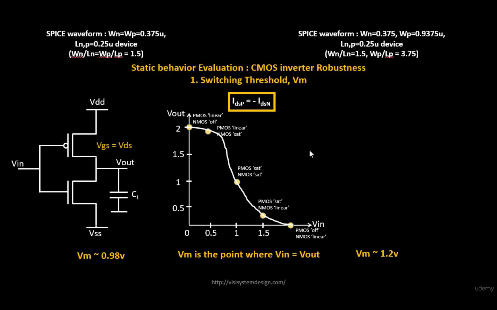
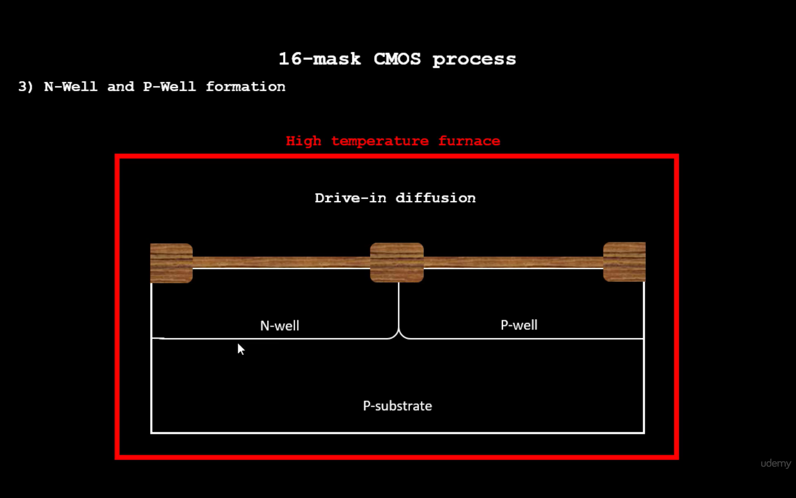
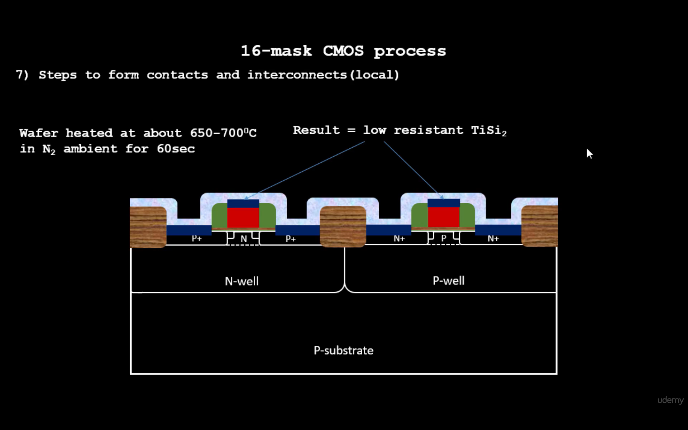

# Module 3 – Design Library Cell Using Magic Layout and ngspice Characterization

## Overview

This module focuses on the design and characterization of a CMOS library cell using the **Magic layout tool** and **ngspice**.

The module covers:

* Floorplan and pin placement
* Equal and unequal pin placement
* VTC and SPICE simulations
* Switching threshold
* Switching behaviour
* CMOS inverter layout
* 16-mask CMOS fabrication process
* Substrate selection
* Active region formation
* N-well and P-well formation
* Diffusion
* Gate formation
* LLD formation
* Source and drain formation
* Contacts and interconnections
* Higher-level metal formation
* Sky130 CMOS inverter SPICE simulation
* Waveform generation and observation

---

# 1. Floorplan and Pin Placement

Floorplanning is an important step in physical design. It determines the physical arrangement of cells, pins and other design elements.

Proper pin placement helps reduce routing complexity and improves the overall layout quality.

Two types of pin placement observations are covered in this module:

1. Equal-distance pin placement
2. Unequal-distance pin placement

## 1.1 Equal-Distance Pin Placement

In equal-distance pin placement, the pins are distributed with approximately equal spacing.

This type of placement provides a more uniform arrangement and can make routing easier.

** FP pin placement equal distance**


### Zoomed View

**FP pin placement equal distance zoom**


---

## 1.2 Unequal-Distance Pin Placement

In unequal-distance pin placement, the spacing between pins is not uniform.

Unequal placement may result in different routing lengths and can affect the physical implementation of the cell.

**FP pin placement not equal distance**


### Zoomed View

**FP pin placement zoom**


---

# 2. VTC SPICE Simulation

The Voltage Transfer Characteristic (VTC) represents the relationship between the input voltage and output voltage of a circuit.

For a CMOS inverter:

* When the input is LOW, the output is HIGH.
* When the input is HIGH, the output is LOW.
* During the transition region, both PMOS and NMOS devices influence the output.

The VTC is useful for understanding the switching behaviour and noise margins of a CMOS inverter.

---

## 2.1 SPICE Deck

A SPICE deck contains the information required to simulate the circuit.

It generally contains:

* Circuit elements
* Device models
* Power supply
* Input conditions
* Analysis commands
* Output/plot commands

** SPICE deck**


---

## 2.2 Switching Threshold

The switching threshold is the input voltage at which the CMOS inverter changes from one logic state to the other.

At the switching point, the behaviour of the PMOS and NMOS devices determines the transition of the inverter.

The switching threshold is an important parameter for analysing CMOS logic performance.

**Switching Threshold**


---

## 2.3 Switching Behaviour

The switching behaviour of a CMOS inverter describes how the output changes when the input changes.

Ideally:

```text
Input LOW  → Output HIGH
Input HIGH → Output LOW
```

The transition region between these two states represents the switching region of the inverter.

**Switching**



---

# 3. CMOS Inverter Layout

A CMOS inverter is one of the fundamental building blocks of digital integrated circuits.

It consists of:

* One PMOS transistor
* One NMOS transistor
* Common input connection
* Common output connection
* VDD connection
* Ground connection

The PMOS is placed in the upper portion of the layout and the NMOS in the lower portion.

The layout represents the physical implementation of the CMOS inverter using the required layers.

** CMOS inverter layout**


---

# 4. 16-Mask CMOS Process

The CMOS fabrication process uses multiple masks to define different regions and structures on the semiconductor wafer.

The major fabrication stages discussed in this module include:

1. Selecting a substrate
2. Creating the active region
3. N-well formation
4. P-well formation
5. Diffusion
6. Gate formation
7. LLD formation
8. Source and drain formation
9. Contact formation
10. Interconnections
11. Higher-level metal formation

---

## 4.1 Selecting a Substrate

The fabrication process begins with the selection of a suitable semiconductor substrate.

The substrate provides the physical foundation on which the different device regions are formed.

**Selecting a substrate**


---

## 4.2 Creating the Active Region

The active region is the portion of the semiconductor where transistor source and drain regions are formed.

Isolation is used to separate neighbouring devices and prevent unwanted electrical interaction.

** Creating active region**


---

## 4.3 N-Well Formation

The N-well provides the region in which the PMOS transistor can be fabricated.

An appropriate mask and implantation/diffusion process is used to create the required N-type region.

**N-well formation**


---

## 4.4 P-Well Formation

The P-well provides the region required for NMOS transistor formation.

It is created using the corresponding mask and doping process.

**P-well formation**


---

## 4.5 Diffusion

Diffusion is used to introduce dopants into selected semiconductor regions.

The diffusion process helps create the required source and drain regions for MOS transistors.

**Diffusion**


---

# 5. Gate Formation

The gate is one of the most important parts of a MOS transistor.

The gate controls the formation of the conducting channel between source and drain.

The gate structure is formed using the appropriate process steps and material layers.

**Formation of gate**


---

## 5.1 Final Gate

The completed gate structure defines the control terminal of the MOS transistor.

The final gate is aligned with the active region to obtain the required transistor structure.

**Final gate**


---

# 6. LLD Formation

LLD stands for **Lightly Doped Drain**.

The LLD region is formed near the source/drain areas to help control electric-field effects near the drain.

It is an important part of the MOS fabrication process.

**LLD formation**


---

# 7. Source and Drain Formation

The source and drain are formed by introducing the required dopants into the semiconductor regions on either side of the gate.

These regions provide the terminals through which current flows when the transistor is switched ON.

** Source and Drain formation**


---

# 8. Contacts

Contacts provide electrical connections between transistor regions and the metal interconnection layers.

They allow signals and supply voltages to reach the appropriate semiconductor regions.

**Contacts**



---

# 9. Contacts and Interconnections

After contact formation, interconnection layers are created to electrically connect different devices and circuit nodes.

Proper interconnection is essential for implementing the complete integrated circuit.

**Contacts and interconnections**


---

# 10. Higher-Level Metal Formation

Higher-level metal layers are used for longer-distance routing and for connecting different portions of the integrated circuit.

Multiple metal levels allow complex circuits to be routed efficiently without excessive interference between connections.

**Higher-level gate formation**


---

# 11. Practical Lab Work

The practical section focuses on the implementation and simulation of a CMOS inverter using the Sky130 technology information.

The required layers are selected and the inverter is simulated using SPICE.

---

## 11.1 CMOS Selected Layer

The required CMOS layers are selected according to the technology and layout requirements.

These layers represent the physical structures used to implement the inverter.

**CMOS selected layer**


---

# 12. Sky130 CMOS Inverter SPICE Code

The Sky130 technology provides the device models required for CMOS circuit simulation.

A SPICE netlist is prepared for the CMOS inverter using the required PMOS and NMOS models.

The simulation setup includes:

* Power supply
* Input signal
* PMOS device
* NMOS device
* Required model information
* Simulation/plot commands

**Sky130 inverter SPICE code**


---

# 13. Editing the SPICE Code

The SPICE code is edited according to the required simulation conditions.

Parameters and commands can be modified to obtain the required input/output response.

**SPICE code edited**


---

# 14. Plotting Commands

Plotting commands are used to display the simulated circuit response.

For a CMOS inverter, the input and output voltages can be observed to verify the expected inverter operation.

**Plotting commands**


---

# 15. CMOS Inverter Waveforms

The waveform obtained from the SPICE simulation demonstrates the switching behaviour of the CMOS inverter.

The output waveform is complementary to the input waveform:

```text
Input  → LOW   → HIGH
Output → HIGH  → LOW
```

The waveform can be analysed to understand the transition and switching behaviour of the inverter.

**CMOS inverter waveforms**


---

## 15.1 Zoomed Waveform

The waveform can be zoomed to clearly observe the transition region and switching behaviour.

A zoomed waveform provides better visibility of the voltage transition.

**Zoomed waveform**


---

# 16. Module Summary

This module provided an understanding of CMOS library-cell design and characterization.

The important concepts covered were:

* Floorplan pin placement
* Equal and unequal pin spacing
* VTC simulation
* SPICE deck
* Switching threshold
* CMOS switching behaviour
* CMOS inverter layout
* 16-mask CMOS fabrication process
* Substrate selection
* Active region formation
* N-well and P-well formation
* Diffusion
* Gate formation
* LLD formation
* Source and drain formation
* Contact formation
* Interconnections
* Higher-level metal formation
* Sky130 CMOS inverter SPICE simulation
* Plotting and waveform analysis

The practical work connects the theoretical CMOS fabrication concepts with the physical layout and SPICE simulation of a CMOS inverter.

---

# 17. Screenshot Directory

Keep all screenshots inside the following folder:

```text
Module-3/
│
├── README.md
│
└── screenshots/
    ├── 1_FP_pin_placement_equi_dist.png
    ├── 1.1_FP_pin_placement_equi_dist_zoom.png
    ├── 2_FP_pin_placement_not_equi_dist.png
    ├── 2.1_FP_pin_placement_zoom.png
    ├── 3_spice_deck.png
    ├── 3.1_switching_threshold.png
    ├── 3.2_switching.png
    ├── 4_cmos_inverter_layout.png
    ├── 5_selecting_a_substrate.png
    ├── 6_creating_active_region.png
    ├── 7_nwell_formation.png
    ├── 7.1_pwell_formation.png
    ├── 7.2_diffusion.png
    ├── 8_formation_of_gate.png
    ├── 8.2_final_gate.png
    ├── 9_lld_formation.png
    ├── 10_source_drain_formation.png
    ├── 11_contacts.png
    ├── 11.1_contacts_and_interconnections.png
    ├── 12_higher_level_gate_formation.png
    ├── 13_cmos_selected_layer.png
    ├── 14_sky130_inv_spice_code.png
    ├── 15_spice_code_edited.png
    ├── 16_plotting_commands.png
    ├── 17_cmos_inv_waveforms.png
    └── 18_zoomed_waveform.png
```


---

# 19. Learning Outcome

After completing this module, the learner should understand the basic relationship between:

```text
CMOS Fabrication
       ↓
Physical Layout
       ↓
Library Cell
       ↓
SPICE Netlist
       ↓
Simulation
       ↓
VTC / Switching Analysis
       ↓
Waveform Observation
```

This provides the foundation for understanding how a CMOS circuit progresses from fabrication concepts and physical layout to electrical characterization and simulation.
# Conclusion

This module provided a practical understanding of CMOS library-cell design and characterization. The concepts covered included floorplan and pin placement, VTC and SPICE simulation, switching threshold, CMOS inverter layout, the 16-mask CMOS fabrication process, and the different stages involved in transistor formation. The practical work further demonstrated Sky130 CMOS inverter simulation, SPICE code modification, plotting commands, and waveform analysis.

Overall, the module helped connect **CMOS fabrication concepts, physical layout, SPICE simulation, and electrical characterization**, providing a foundation for understanding the implementation of CMOS library cells in VLSI design.

---

# Author

**Rohith Reddy**

**B.Tech – Electronics and Communication Engineering (ECE)**

**Anurag University**

