# Module 4 – Pre-layout Timing Analysis and Importance of Good Clock Tree

## Overview

This module focuses on **pre-layout timing analysis** and the importance of a **good clock tree** in VLSI physical design.

The module covers practical and theoretical concepts related to:

* Tracks and routing information
* Grid definition
* Cell width and height
* Port definition
* LEF files
* Standard-cell library files
* Synthesis
* NAND and NOR cells
* Power-aware Clock Tree Synthesis (CTS)
* Cell placement
* Timing analysis
* STA configuration
* SDC constraints
* Clock Tree Synthesis
* Clock buffers
* Clock-net shielding
* Clock glitches
* Clock skew
* Timing analysis using real clocks

The concepts help in understanding how physical implementation and clock distribution affect the timing performance of a digital design.

---

# 1. Tracks and Routing Information

In physical design, the chip layout is divided into routing tracks.

A **track information file** defines the routing tracks available for different metal layers. These tracks provide the locations through which interconnections can be routed.

Track information is important because routing tools use the defined tracks to connect cells and signals while following the technology rules.

## Practical Lab Work

**Tracks.Info file**


---

# 2. Grids

A physical layout uses a grid to define valid locations for placing cells and routing wires.

The grid provides a regular coordinate system that helps the physical-design tools place objects accurately and maintain alignment with the manufacturing technology.

A properly defined grid is important for:

* Cell placement
* Routing
* Alignment
* Design-rule compliance

**Grids**

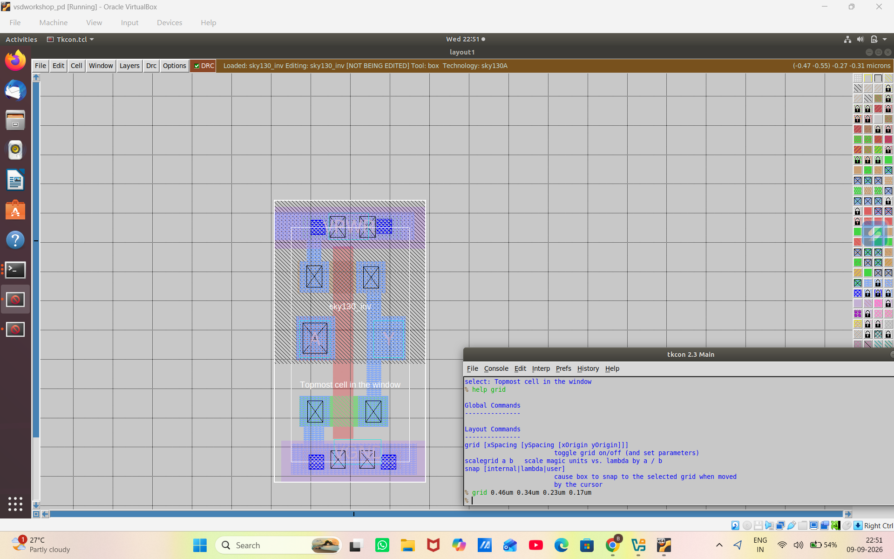
---

# 3. Cell Width

The width of a standard cell determines the amount of horizontal space occupied by the cell.

Cell dimensions are important during placement because the physical-design tool must arrange cells without unwanted overlap.

The cell width also affects:

* Placement density
* Routing resources
* Overall chip area

**Width**

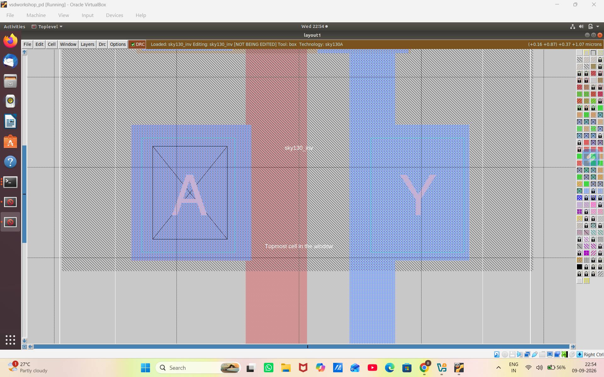

---

# 4. Cell Height

Cell height determines the vertical dimension of a standard cell.

Standard cells generally follow a fixed-height architecture so that they can be placed in rows efficiently.

Consistent cell height helps the placement tool create organized standard-cell rows.

**Height**

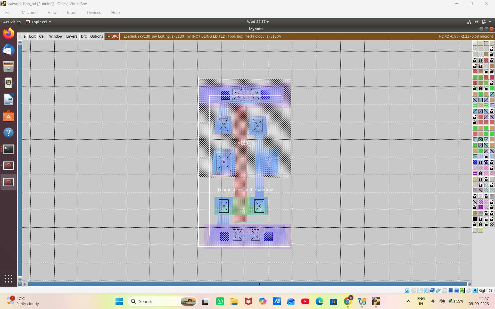
---

# 5. Defining Ports

Ports provide the interface between a cell/design and the external signals connected to it.

During physical implementation, ports must be properly defined so that the physical-design tools understand:

* Input connections
* Output connections
* Signal locations
* Connectivity information

Proper port definition is necessary for successful placement and routing.

**Defining ports**


---

# 6. Sky130 VSD Inverter LEF

LEF stands for **Library Exchange Format**.

A LEF file provides the physical information required by physical-design tools for a standard cell.

It can contain information such as:

* Cell dimensions
* Pin locations
* Metal layers
* Routing information
* Obstructions

The LEF representation allows the physical-design tools to use the cell during placement and routing without requiring the complete transistor-level layout information.

**Sky130 VSD inverter LEF**


---

# 7. Sky130 Standard-Cell Library – Typical Corner

Standard-cell libraries contain timing and power information for the cells used during digital implementation.

The **typical** library represents a nominal operating condition.

Library timing information is required by timing-analysis tools to calculate the delay of logic paths.

**Sky130 standard-cell typical library**

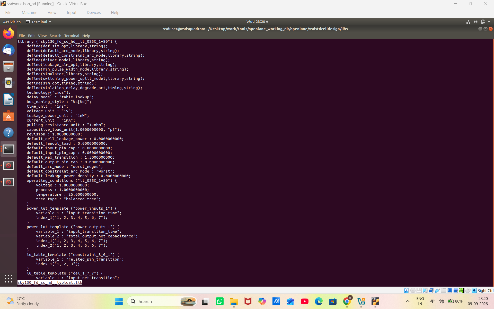

---

# 8. Sky130 Standard-Cell Library – Fast Corner

The fast library represents a process/voltage/temperature condition under which the cells operate faster.

Different library corners are required because cell delay changes with operating conditions.

Timing analysis considers these variations to determine whether the design satisfies its timing requirements.

**Sky130 standard-cell fast library**

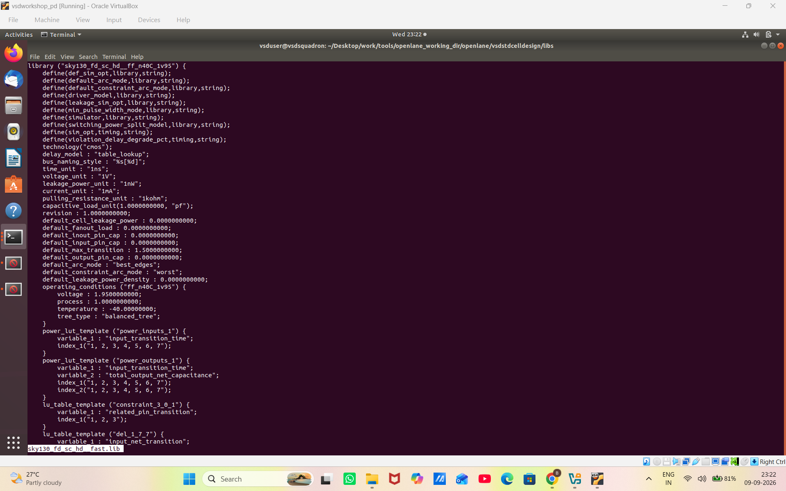
---

# 9. Sky130 Standard-Cell Library – Slow Corner

The slow library represents a condition under which the cells operate more slowly.

Slow corners are particularly important for checking whether signal paths meet their required timing constraints under worst-case delay conditions.

Using multiple library corners makes timing analysis more reliable.

**Sky130 standard-cell slow library**

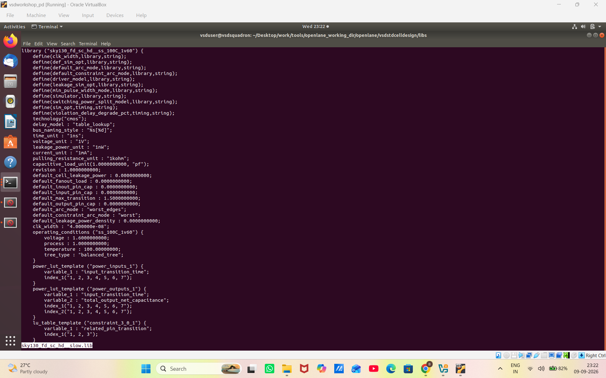
---

# 10. Synthesis

Synthesis converts the RTL description of a digital design into a gate-level representation using available standard cells.

The synthesis process maps the required logic to cells from the standard-cell library.

A simplified flow is:

```text
RTL
 ↓
Logic Synthesis
 ↓
Gate-Level Netlist
 ↓
Physical Design
```

The synthesized netlist becomes the input for later physical-design stages such as placement, clock-tree synthesis and routing.

**Synthesis**

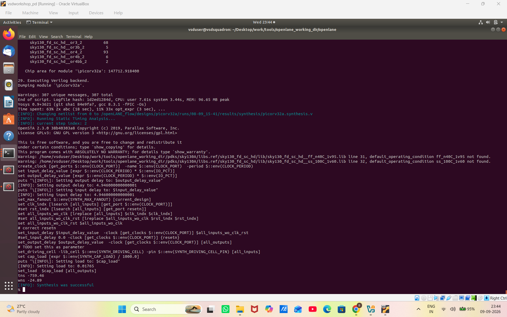

---

# 11. NAND and NOR

NAND and NOR gates are fundamental logic cells used to construct digital circuits.

## NAND Gate

A NAND gate produces LOW only when all its inputs are HIGH.

For a two-input NAND:

```text
A B | Y
---------
0 0 | 1
0 1 | 1
1 0 | 1
1 1 | 0
```

## NOR Gate

A NOR gate produces HIGH only when all its inputs are LOW.

For a two-input NOR:

```text
A B | Y
---------
0 0 | 1
0 1 | 0
1 0 | 0
1 1 | 0
```

These cells are important building blocks in standard-cell libraries.

**NAND & NOR**


---

# 12. Power-Aware Clock Tree Synthesis

Clock Tree Synthesis (CTS) distributes the clock signal from its source to all required sequential elements.

A good clock tree should provide:

* Low clock skew
* Controlled clock latency
* Reliable clock distribution
* Acceptable power consumption

Power-aware CTS considers the power consumed by clock buffers and the clock network while constructing the tree.

Reducing unnecessary clock switching and controlling the number and size of buffers can help reduce clock-network power.

**Power-aware CTS**


---

# 13. Power-Aware CTS – Further Analysis

Power-aware CTS involves balancing timing requirements with power consumption.

Increasing the number or size of clock buffers may improve signal integrity and timing, but it can also increase:

* Dynamic power
* Clock capacitance
* Buffer power
* Overall clock-network power

Therefore, CTS must achieve a suitable balance between timing and power.

**Power-aware CTS 2**


---

# 14. Cell Placement

Placement determines the physical locations of standard cells inside the chip.

After synthesis, the gate-level cells must be placed within the available core area.

Good placement aims to:

* Reduce wire length
* Reduce congestion
* Improve timing
* Provide sufficient routing resources
* Maintain design-rule requirements

**Placement cell**

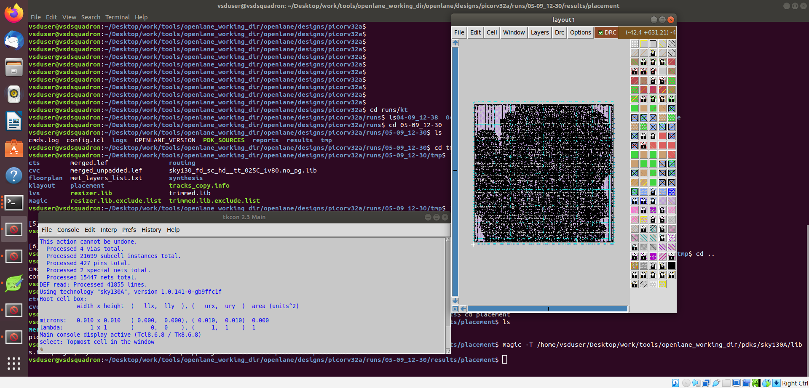
---

# 15. Placement – Zoomed View

The zoomed-out placement view provides an overall view of the placed cells within the design area.

It helps observe the physical distribution of the cells and the overall placement structure.

** Placement zoom in**

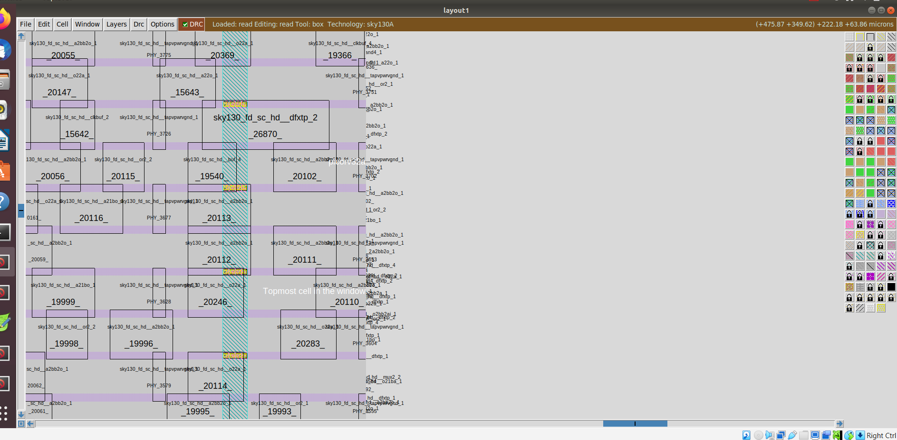
---

# 16. Timing Analysis

Timing analysis determines whether signals propagate through the design within the required time limits.

The main objective is to verify that all important paths satisfy their timing constraints.

Static Timing Analysis (STA) evaluates timing without applying functional simulation patterns.

Important timing parameters include:

* Arrival time
* Required time
* Slack
* Clock latency
* Data-path delay
* Clock-path delay

A positive slack generally indicates that the timing requirement is satisfied, while negative slack indicates a timing violation.

**Timing analysis**


---

# 17. Timing Analysis – Detailed View

Timing analysis examines the paths between sequential elements and determines whether the data reaches the destination within the required timing window.

A simplified setup relationship can be represented as:

```text
Clock Launch
     ↓
Launch Flip-Flop
     ↓
Combinational Logic
     ↓
Capture Flip-Flop
     ↓
Clock Capture
```

The timing tool evaluates the complete launch-to-capture path.

**Timing analysis**

---

# 18. Pre-STA Configuration

Before Static Timing Analysis, the required configuration and timing information must be provided.

The STA configuration defines the information required by the timing-analysis flow.

This can include:

* Design information
* Library information
* Timing constraints
* Clock definitions
* Input/output constraints

**pre_sta.conf**

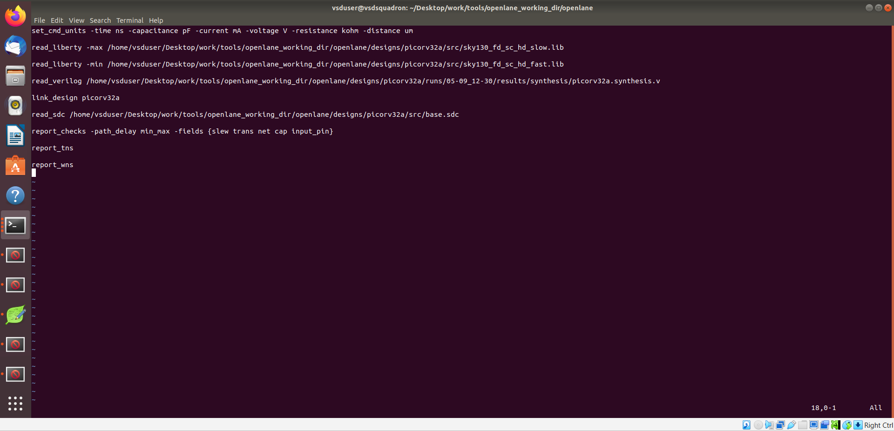

---

# 19. SDC Constraints

SDC stands for **Synopsys Design Constraints**.

SDC constraints describe the timing requirements of the design.

Typical constraints include:

* Clock definition
* Input delay
* Output delay
* Timing exceptions
* Clock uncertainty

A clock constraint provides the timing reference required by STA.

For example:

```tcl
create_clock -name clk -period 10 [get_ports clk]
```

The actual constraint values depend on the design requirements.

**mybase.sdc**

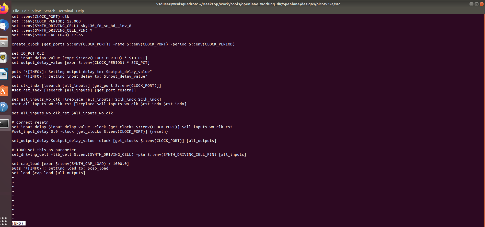
---

# 20. Clock Tree Synthesis

Clock Tree Synthesis is the process of constructing a clock distribution network from the clock source to the sequential elements.

Without a properly designed clock tree, different flip-flops may receive the clock at different times.

A CTS flow can be represented as:

```text
              Clock Source
                   |
              Clock Buffer
               /       \
             /           \
         Buffer          Buffer
         /   \           /   \
       FF    FF         FF    FF
```

The goal is to distribute the clock with controlled skew and latency.

**Clock Tree Synthesis**


---

# 21. Clock Tree Synthesis Buffers

Clock buffers are used to drive the capacitance associated with the clock network.

They help maintain the required clock signal strength as the clock travels through the design.

The CTS tool selects and arranges buffers to achieve the required timing characteristics.

**Clock Tree Synthesis buffers**


---

# 22. Clock Net Shielding

Clock signals are highly sensitive to unwanted interference because they are distributed across a large portion of the chip.

Clock-net shielding is used to reduce coupling and interference from neighbouring signal wires.

Shielding can improve clock-signal integrity by reducing unwanted capacitive coupling.

**Clock net shielding**


---

# 23. Clock Glitch

A clock glitch is an unwanted temporary transition on a clock signal.

Since sequential elements respond to clock transitions, unwanted glitches can cause incorrect or unintended circuit behaviour.

Sources of clock glitches can include:

* Improper clock logic
* Unequal path delays
* Coupling
* Poor clock-network design

Therefore, clock signals should be carefully generated and distributed.

**Glitch**

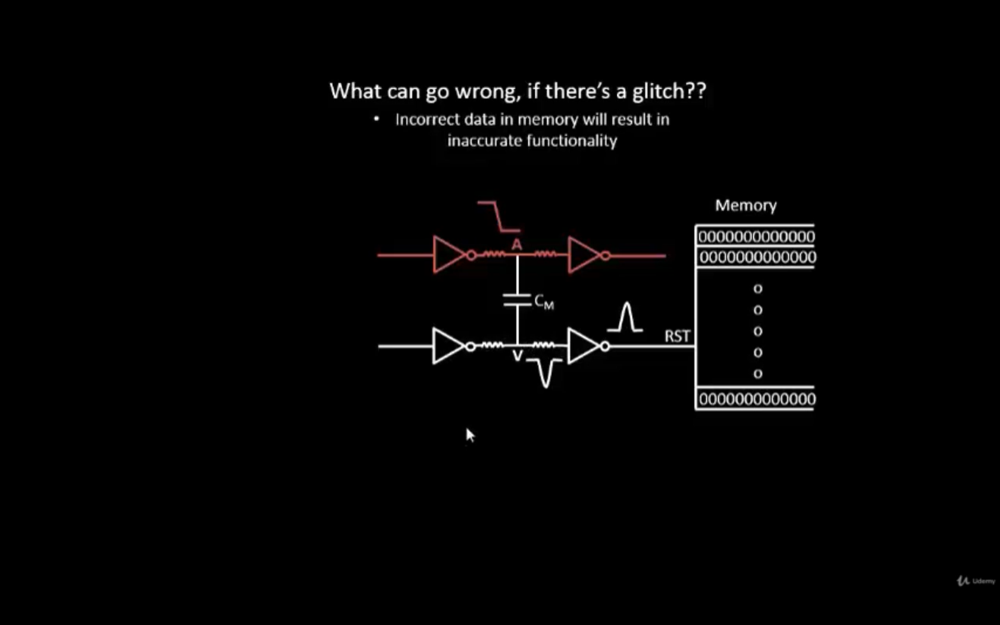

---

# 24. Clock Skew

Clock skew is the difference in arrival time of the same clock signal at different sequential elements.

For example:

```text
Clock Source
     |
     +------> FF1
     |
     +----------> FF2
```

If the clock reaches FF1 and FF2 at different times, the difference is clock skew.

Ideally, CTS attempts to minimize unwanted skew.

High skew can cause timing problems and may result in setup or hold violations.

**Skew**

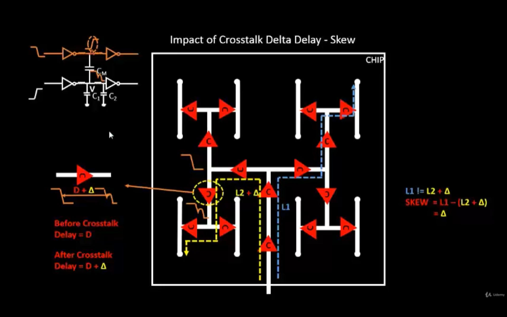
---

# 25. Timing Analysis With Real Clock

After clock-tree implementation, timing analysis can be performed using the real clock network rather than an ideal clock assumption.

The real clock includes the delays introduced by:

* Clock buffers
* Clock routing
* Clock interconnect
* Clock distribution network

This gives a more realistic representation of the actual timing behaviour of the design.

**Timing analysis with real clock**


---

# 26. Timing Analysis With Real Clock – Detailed View

The final timing analysis considers the real clock arrival times at the sequential elements.

This allows the timing tool to evaluate the effect of actual clock latency and skew on the design.

The comparison between ideal-clock and real-clock analysis helps identify the timing impact introduced by the physical clock network.

**Timing analysis with real clock**


---

# Module Flow

The overall concepts covered in this module can be summarized as:

```text
Technology Information
        ↓
Tracks and Grids
        ↓
Cell Dimensions
        ↓
Port Definition
        ↓
LEF
        ↓
Standard-Cell Libraries
        ↓
Synthesis
        ↓
Placement
        ↓
Timing Analysis
        ↓
SDC Constraints
        ↓
Clock Tree Synthesis
        ↓
Clock Buffers
        ↓
Clock Shielding
        ↓
Skew / Glitch Analysis
        ↓
Timing Analysis with Real Clock
```

---

# Key Learning Outcomes

After completing this module, the following concepts are understood:

* Importance of routing tracks and grids
* Standard-cell dimensions
* Port definition
* Purpose of LEF files
* Role of standard-cell timing libraries
* Typical, fast and slow library corners
* Basic synthesis flow
* NAND and NOR standard cells
* Importance of power-aware CTS
* Standard-cell placement
* Static Timing Analysis
* STA configuration
* SDC timing constraints
* Clock Tree Synthesis
* Clock-buffer insertion
* Clock-net shielding
* Clock glitches
* Clock skew
* Timing analysis using real clock information

---

# Conclusion

This module provides an understanding of the relationship between **physical implementation, timing analysis and clock distribution** in VLSI design.

The practical work begins with technology information such as tracks, grids, cell dimensions, ports, LEF and standard-cell libraries. The flow then progresses through synthesis, placement and timing analysis.

The theoretical concepts introduce the importance of **Clock Tree Synthesis, power-aware CTS, clock buffers, shielding, clock skew and clock glitches**. Finally, timing analysis using the real clock network demonstrates how the physical clock distribution affects the timing behaviour of the design.

Overall, this module establishes the importance of a properly designed clock tree and accurate timing analysis for achieving reliable and high-performance digital VLSI circuits.

---

# Author

**Rohith Reddy**

**B.Tech – Electronics and Communication Engineering (ECE)**

**Anurag University**
