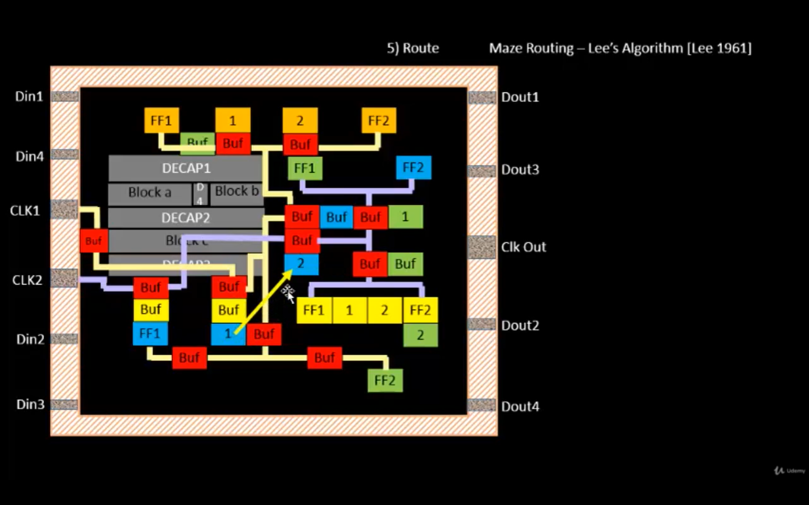
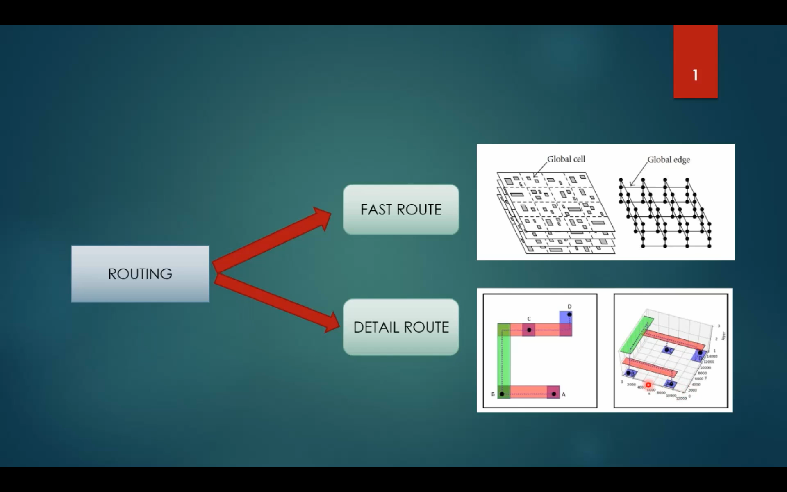

# Module 5 - Final Steps for RTL2GDS using TritonRoute and OpenSTA

## Introduction

Module 5 covers the final steps of the RTL-to-GDSII flow, focusing on routing and the concepts involved in converting the placed design into a physically connected layout.

The major concepts covered in this module are:

* Route
* Maze Routing
* Maze Routing Algorithm
* Maze Routing using Lee's Algorithm
* DRC Clean
* Parasitic Extraction
* Preprocessed Route Guides
* Routing
* Panel Routing
* TritonRoute
* Routing Topology Algorithm

> **Note:** This repository contains **theory concepts only**. Practical/lab implementation will be maintained separately in another repository.

---

# 1. Route

Routing is the process of creating physical connections between the different components of a digital design after placement.

During the routing stage, the router connects the pins of standard cells, macros and input/output ports using the available metal layers and vias.

The main objective of routing is to establish all required connections while satisfying the physical and manufacturing constraints of the technology.

Routing has to consider:

* Metal layers
* Routing tracks
* Wire width
* Wire spacing
* Via placement
* Design rules
* Routing congestion
* Connectivity
* Timing requirements

Routing is one of the important stages in the RTL-to-GDSII flow because the logical connections of the design are converted into actual physical interconnections.


**`Route`**



---

# 2. Maze Routing

Maze routing is a routing technique in which the routing area is represented as a grid.

The router searches through the grid to find a valid path between a source and destination while avoiding obstacles.

Obstacles may include:

* Existing wires
* Standard cells
* Macros
* Blockages
* Other routing restrictions

Instead of always trying to connect two points using a straight line, maze routing searches through different possible paths until a valid path is found.

Maze routing is useful for understanding how a routing tool can solve complex routing problems in a constrained physical layout.


**`Maize routing`**


---

# 3. Maze Routing Algorithm

The Maze Routing Algorithm searches for a valid path between two points on a routing grid.

The routing grid consists of available and blocked locations.

The basic working principle is:

1. Start from the source location.
2. Mark the source with an initial value.
3. Expand the search to neighboring available locations.
4. Assign increasing values to the newly reached locations.
5. Continue the expansion until the destination is reached.
6. Trace the path back from the destination to the source.
7. The resulting path becomes the required route.

This approach allows the router to find a valid path even when obstacles prevent direct routing.

Maze routing is closely related to **Lee's Algorithm**, which uses a wave-propagation technique to search the routing grid.


** `Maize routing algorithm`**


---

# 4. Maze Routing - Lee's Algorithm

Lee's Algorithm is a classical algorithm used for maze routing.

It treats the routing problem as a path-search problem on a grid.

The algorithm mainly consists of two stages:

## Wave Propagation

The algorithm starts at the source and propagates through the available grid locations.

Each reachable location is assigned a distance value based on its distance from the source.

The propagation continues until the destination is reached.

## Path Traceback

After reaching the destination, the algorithm traces the path backwards by following locations with decreasing distance values.

This produces the final route from the destination back to the source.

### Advantages

* Finds a valid path if one exists.
* Can handle obstacles.
* Provides a systematic routing method.
* Easy to understand using a grid representation.

### Limitation

For very large routing problems, exhaustive grid searching can require significant computation and memory.


**`maize routing lees`**


---

# 5. DRC Clean

DRC stands for **Design Rule Check**.

After routing, the physical layout must satisfy the manufacturing rules of the selected technology.

DRC checks whether the layout contains violations of physical design rules.

Typical design rules include:

* Minimum metal width
* Minimum metal spacing
* Via rules
* Metal enclosure rules
* Layer-specific restrictions
* Other manufacturing constraints

A **DRC-clean** design means that the layout has passed the applicable design-rule checks without violations.

DRC is important because a design can be logically correct but still be physically impossible to manufacture if the layout violates fabrication rules.

Therefore, DRC checking is an important part of the final physical-design verification process.


**`Drc clean`**


---

# 6. Parasitic Extraction

Parasitic extraction is the process of determining the unwanted electrical effects introduced by the physical interconnections of the design.

Physical wires are not ideal. They contain resistance and capacitance.

Important parasitic effects include:

* Wire resistance
* Wire capacitance
* Coupling capacitance
* Via resistance
* Interconnect delay

Before routing, interconnect effects are generally estimated.

After routing, the actual physical geometry of the wires is available, allowing more accurate parasitic information to be obtained.

The extracted parasitic information can then be used for accurate timing and electrical analysis.

### Importance of Parasitic Extraction

Parasitic extraction helps connect the physical layout with its actual electrical behavior.

The general relationship can be represented as:

```text
Physical Layout
      ↓
Interconnect Geometry
      ↓
Parasitic Extraction
      ↓
Resistance + Capacitance
      ↓
Accurate Electrical/Timing Analysis
```


**`Parasitic extraction`**


---

# 7. Preprocessed Route Guides

Route guides provide information about the regions through which the routing connections should pass.

Before detailed routing, route-guide information may be processed into a form that can be efficiently used by the detailed router.

The preprocessing of route guides helps organize the routing information and prepare it for detailed routing.

The concept covered in this section includes important requirements for route guides.

### Unit Width

The guide should have unit width so that the routing information can be properly represented on the routing grid.

### Preferred Direction

The guide should follow the preferred routing direction of the corresponding metal layer.

Different metal layers generally have preferred routing directions.

For example:

```text
Metal Layer → Preferred Direction
      ↓
Horizontal / Vertical
      ↓
Efficient Routing
```

Following preferred directions helps reduce routing conflicts and improves routing efficiency.


** `Preprocessed route guides`**


---

# 8. Routing

Routing converts the connectivity information of the placed design into actual physical interconnections.

The routing process can be understood through different stages.

## Fast / Global Routing

Fast or global routing determines approximate routing paths and identifies the routing resources required for the different nets.

It provides information about:

* Approximate routing paths
* Routing resources
* Congestion
* Connectivity

## Detailed Routing

Detailed routing determines the exact physical route.

It considers:

* Exact metal tracks
* Metal layers
* Vias
* Wire width
* Wire spacing
* Design rules
* Connectivity

Therefore, routing progresses from an approximate solution toward an exact physical implementation.


** `Routing`**



---

# 9. Panel Routing

Panel routing is a routing approach in which the routing problem is divided into smaller sections called panels.

Dividing the routing area into panels helps manage a large routing problem more efficiently.

The concept covered in this module includes:

**Intra-layer parallel and inter-layer sequential panel routing**

## Intra-layer Parallel Routing

Intra-layer routing refers to routing within the same metal layer.

Multiple routing operations may be performed in parallel when the routing conditions allow it.

This helps improve routing efficiency.

## Inter-layer Sequential Routing

Inter-layer routing involves connections between different metal layers.

Vias are used when a connection needs to move from one metal layer to another.

The routing process therefore considers both:

* Routing within a layer
* Connections between layers

Panel routing helps organize the detailed routing problem into manageable sections.


**`Panel routing`**


---

# 10. TritonRoute

TritonRoute is a detailed routing tool used in the open-source RTL-to-GDSII flow.

Its main purpose is to generate detailed physical routes while satisfying the required routing constraints and design rules.

TritonRoute has to maintain correct connectivity between different routing objects.

One important concept associated with TritonRoute is **connectivity handling**.

---

## Access Point (AP)

An **Access Point (AP)** is an on-grid point on a metal layer of a route guide.

Access points provide possible locations through which different routing segments can be connected.

They can be used to connect:

* Metal segments
* Pins
* I/O ports
* Different metal layers

Access points are therefore important for establishing physical connectivity during detailed routing.

---

## Access Point Cluster (APC)

An **Access Point Cluster (APC)** is a collection or union of access points associated with the same routing object or segment.

An APC can be associated with:

* Lower-layer segments
* Upper-layer guides
* Pins
* I/O ports

The concept of APs and APCs helps the router determine possible connection locations and maintain the connectivity of each net.

---

## Connectivity Handling

During detailed routing, all terminals belonging to the same net must eventually be connected.

TritonRoute therefore has to consider:

* Route guides
* Metal segments
* Access points
* Access point clusters
* Pins
* I/O ports
* Layer transitions

Correct connectivity is essential for obtaining a functionally correct physical layout.


** `Triton route`**


---

# 11. Routing Topology Algorithm

Routing topology describes the structure used to connect multiple terminals belonging to the same net.

For a net containing multiple terminals, the router needs to determine an efficient way of connecting all the terminals.

The routing topology algorithm helps optimize these connections.

Important factors include:

* Terminal locations
* Access points
* Connection distance
* Routing cost
* Wire length
* Connectivity
* Optimization

The goal is to create an efficient topology that connects all required terminals without unnecessary routing.

---

## Minimum Spanning Tree Concept

A Minimum Spanning Tree (MST) is a structure that connects a set of nodes while minimizing the total connection cost.

In routing, MST concepts can be used to determine an efficient topology for connecting multiple terminals.

The general idea is:

```text
Multiple Terminals
       ↓
Determine Possible Connections
       ↓
Calculate Connection Cost
       ↓
Optimize Topology
       ↓
Efficient Routing Structure
```

An optimized routing topology can reduce unnecessary wire length and routing cost while maintaining connectivity.


**`Routing topology algorithm`**


---

# Module 5 Concept Flow

The overall conceptual flow covered in Module 5 can be represented as:

```text
Final RTL2GDS Steps
        ↓
      Route
        ↓
   Maze Routing
        ↓
Maze Routing Algorithm
        ↓
  Lee's Algorithm
        ↓
Preprocessed Route Guides
        ↓
     Routing
        ↓
  Panel Routing
        ↓
   TritonRoute
        ↓
Connectivity Handling
        ↓
Routing Topology Algorithm
        ↓
     DRC Clean
        ↓
Parasitic Extraction
        ↓
Final Physical Design
```

---

# Key Concepts Learned

* Routing creates physical connections between components of a placed design.
* Maze routing treats routing as a path-search problem.
* Lee's Algorithm uses wave propagation and path traceback.
* Route guides provide routing information for detailed routing.
* Preprocessed route guides are prepared according to routing requirements.
* Preferred routing directions help organize metal-layer routing.
* Panel routing divides the routing problem into smaller sections.
* TritonRoute is used for detailed routing.
* Access Points provide possible connection locations.
* Access Point Clusters help organize connectivity information.
* Routing topology algorithms optimize the connection structure of multi-terminal nets.
* DRC checks the physical layout against technology design rules.
* Parasitic extraction determines resistance and capacitance effects caused by physical interconnects.

---

# Practical Work

The practical implementation of Module 5 is **not included in this repository**.

This repository contains only the **theory concepts and related screenshots**.

The practical work, tool commands, execution screenshots, routing results and other laboratory activities will be completed later in a **separate practical repository**.

---

# Conclusion

Module 5 explains the final physical-design concepts involved in the RTL-to-GDSII flow.

The module begins with routing and maze-routing concepts and explains Lee's Algorithm for finding paths through a routing grid. It then covers route guides, routing, panel routing and TritonRoute.

The module also introduces connectivity handling through Access Points and Access Point Clusters, routing topology optimization, DRC cleaning and parasitic extraction.

Together, these concepts provide an understanding of how the physical design progresses toward a final routed layout while satisfying connectivity, routing and manufacturing requirements.

---

# Author

**Rohith Reddy**

B.Tech - Electronics and Communication Engineering
